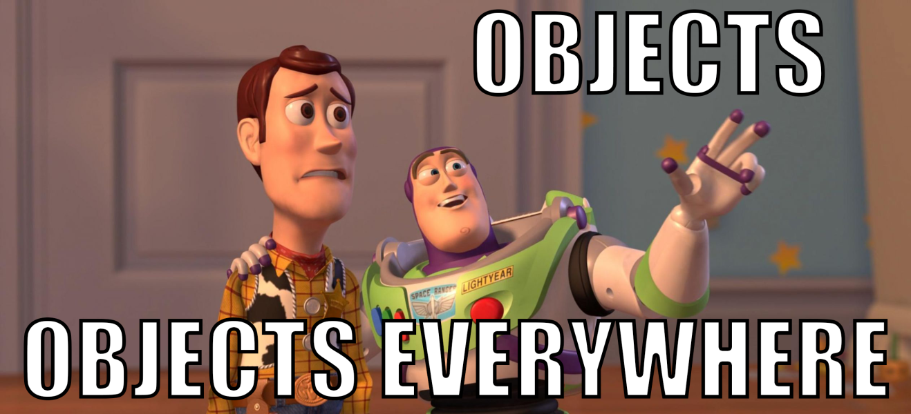
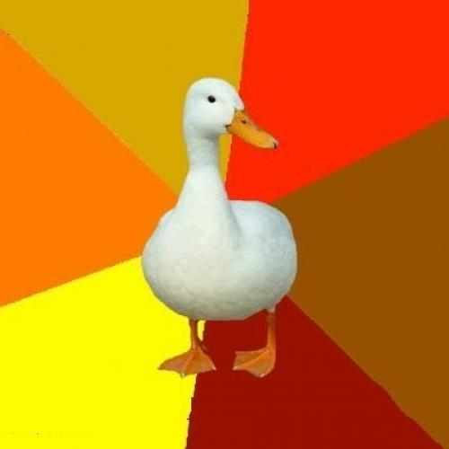

**Language 1:  Ruby**

First, some housekeeping. 

*I’m retyping the code snippets almost exactly from the book I’m working through with some minor tweaks, asides, and experiments of my own added in. Most of this Ruby code is in fact not my own original work and belongs to the author. When a difference in syntax occurs between the book listing and the Ruby 3.4.1 version I am currently using, I will use Ruby 3.4.1 syntax.* 

*Some of the verbiage discussing the language and the associated listings are essentially rephrasing the original source material with some of my own additional commentary added in.*

I did key in and follow every one of these examples using a distribution of `irb` that I installed on my personal machine (an Apple Silicon MacBook Pro). Here’s what I’m running for my Ruby distribution at time of writing: 

``` shell
$ ruby --version
ruby 3.4.1 (2024-12-25 revision 48d4efcb85) +PRISM [x86_64-darwin23]
$ irb --version
irb 1.14.3 (2024-12-18)

```

---

**Introduction to Ruby:**
For years I kept looking at Ruby and thinking, *I should really learn that language.*, but it never came up as a language to use in the organizations I worked with. Typically, I do my work in popular languages for scientific computing (Python, C/C++, etc.) or in an embedded context (pretty much just C/C++, *maybe* a bit of MicroPython.) Ruby just never seemed to be something I needed, but I did *want* to understand it. 

Many of my headaches with getting my programming environments and package managers set up might have been easier to grok if I understood how they were written – and these often seemed to be written in Ruby. Those mysterious `Gem`s taunted me from my otherwise well-understood terminal UI.

Ruby is apparently an example of an almost entirely pure Object Oriented (OO) language. I have worked extensively with the OO structures and techniques in Python and C++, but Ruby seems different even at first glance. 

As someone who was brought up with a *very* procedural, imperative programming style in general – starting with C99 way back in 2005, then learning Python 2.x later on in my undergraduate career – OO programming always seemed like “too much stuff” to accomplish the same tasks for what I was doing (again, primarily procedural, scientific calculations and a bit of simulation work.) My first dipped phalanges into OO programming came with using Python to model classical mechanics in an undergraduate physics class. 

As I grew as a developer, I realized that some problem statements really *do* lend themselves well to an OO paradigm and programming model, as I found myself writing simply tons of procedural code to accomplish things that seemed to be almost *too* simple and terse in OO languages like Java or using the OO features in Python. 

At first blush, it feels almost like a dialect of Python (please don’t be angry with my, Ruby aficionados, I know it’s nearly as old as Python) with different tokens, like `{}` instead of `()`, or using `puts` instead of `print()` – it even has a really nice REPL (`irb`) with syntax highlighting features built in! 

In the `irb` REPL every statement returns a value, even if that value is `nil`.  I gather from Internet discourse that the very idea of `nil` is the source of a great many sore skulls, but that is just how Ruby is built, I guess.  

I guess it’s time to make friends with the dot operator! 


---


**Day 1:  Objects. Objects, everywhere!**

The number `4`.  It’s an integer. It’s also a number. It has a value. In Ruby, it’s a member of a `class`, specifically the `class` of `Integer`, like so: 

```ruby
irb(main):008> 4
=> 4
irb(main):009> 4.class
=> Integer

```

So, as a class, it surely contains methods, right? 

```ruby
irb(main):011> 4.methods
=>
[:abs,
 :floor,
 :ceil,
 :round,
 :truncate,
 :-@,
 :**,
 :<=>,
 :<<,
 :>>,
 :allbits?,
 :anybits?,
 :nobits?,
 :downto,
 :pred,
 :pow,
 :next,
 :>=,
 :==,
 :===,
 :<=,
  ...
 ]
    
```

Yes! As with all individuals, the number 4 contains multitudes here! So it seems that essentially every number, variable, operator… everything is a `class`, it seems. 

Interestingly, the `methods`… uh… method, contains an event loop, at least in my version of Ruby’s `irb` REPL. 


You have to press `q` to quit it. It is, however, a very long list of methods. Presumably, each number as a member of `class` `Integer` has access to every one of these methods! 

Any of these methods can be called with the dot operator. 

Furthermore, the variable datatype in Ruby takes on the `class` of the value assigned to it. For example, 

```ruby
irb(main):012> x = 4
=> 4
irb(main):013> x.class
=> Integer
irb(main):014> x = 4.0
=> 4.0
irb(main):015> x.class
=> Float

```

Note that the `return` value for the `.class` method changes when the value is changed to a different datatype (in this example, an `Integer` to a `Float`). 

---
**Decisions, Decisions:**

Ruby has a similar structure to other procedural languages when it comes to `branching`. 

```ruby
irb(main):023> x = 4
=> 4
irb(main):024> x > 5
=> false
irb(main):025> x < 5
=> true
irb(main):026> x <= 5
=> true
irb(main):027> x <= 4
=> true
irb(main):028> false.class
=> FalseClass
irb(main):029> true.class
=> TrueClass

```

Interesting. I would have expected that the `.class` method would return the *same* type for both `true` and `false`, but they are *different classes*?  Still, the branching and return values behave as one would expect from any other programming language. Perhaps `TrueClass` and `FalseClass` are subclasses or somehow derived from an overarching `boolean` class? 

*Sidebar: I skipped ahead in the book to Day 2 because I was curious. It seems that the class, superclass, and superclass superclass — until the base class is reached, anyway —  can be used to explore the inheritance structures of objects, child classes, and parent/super classes. Doing this with the `TrueType` and `FalseType` objects `true` and `false` shows us that:*

```ruby
irb(main):054> true.class
=> TrueClass
irb(main):055> true.class.superclass
=> Object
irb(main):057> true.class.superclass.superclass
=> BasicObject
irb(main):058> true.class.superclass.superclass.superclass
=> nil

irb(main):060> false.class
=> FalseClass
irb(main):061> false.class.superclass
=> Object

```

*It seems that `TrueClass` and `FalseClass` are both distinct subclasses (or children?) of class `Object`, which is a subclass of `BasicObject` in the Ruby interpreter.*

Now back to our regularly scheduled Day 1 content! 

In Ruby, `true` and `false` are so-called “first-class” objects, which apparently means that code can be branched conditionally with them as well. Ruby seems to have a couple of options for doing this, the `unless` and `if` keywords: 

```ruby
irb(main):030> puts 'This appears to be false.' unless x == 4
=> nil
irb(main):031> puts 'this appears to be true.' if x == 4
this appears to be true.

```

which seems amenable to quick one-liner branching statements. Seems like it would be very useful for cases like printing logging output or performing a quick counter increment.

There is also the more traditional – and more familiar to me as a C and Python programmer– block form `if/else` structure:

``` ruby
irb(main):034* if x == 4
irb(main):035*   puts 'this appears to be true'
irb(main):036* else
irb(main):037*   puts 'this appears to be false.'
irb(main):038> end
this appears to be true
=> nil

```

Interesting again! Every structure seems to return `nil` and terminal outputs like `this appears to be true` seem to be “side-effects”? 

To me, `unless` seems like a touch of “syntactic sugar” to aid in readability of the code, since it could also simply be expressed with `!` or `not`, but `unless` seems more immediately readable to someone just skimming the code. 

The book provides the example of this readability with the expression: 

```ruby
order.calculate_tax unless order.nil? 

```

which, with my currently limited knowledge, seems to express the idea “use the `*.calculate_tax` method on the `order` if the `order` is not (‘unless the order is’) of `class`/value `nil` (it doesn't exist!) where the `*.nil?` method will return a boolean-type value indicating whether or not the value object of interest is, in fact, value `nil`. 

Two more keywords are introduced here:  `while` and `until`. 

The `while` keyword iterates with an initial test condition, looping until the condition is no longer met: 

```ruby
irb(main):046> x = x + 1 while x < 10
=> nil
irb(main):047> x
=> 10

```

Similarly, the `until` keyword also creats an iterative structure. Resetting `x = 0`, 

```ruby
irb(main):070> x = x + 1 until x == 10
=> nil
irb(main):071> x
=> 10

```

They are semantically slightly different, as `until` is a definite set-point with an equality test. Keyword `while` on the other hand serves more as a boundary condition. I can’t exactly express **why** these seem so different in my head yet, but they give the impression of having distinctly different uses. 

In a block format for iteration and printing out values (again, as side effects), 

``` ruby
irb(main):077> x = 0
=> 0
irb(main):078* while x < 10
irb(main):079*   puts x
irb(main):080*   x = x + 1
irb(main):081> end
0
1
2
3
4
5
6
7
8
9
=> nil

irb(main):082> x = 0
=> 0
irb(main):083* while x <= 10
irb(main):084*   puts x
irb(main):085*   x = x + 1
irb(main):086> end
0
1
2
3
4
5
6
7
8
9
10
=> nil

```

Alternatively, setting the endpoint condition `x == 10`, and using the `until` keyword in a block format does not seem to be possible… unless it’s in a `do - while` type structure that would be found in C? Right now I do not know the language well enough to implement a loop using `until` in a block format like with the `while` keyword. 

Apparently the `true` and `false` expressions are also aliases for other values, according to the book, as follows: 

``` ruby
irb(main):087> puts 'this appears to be true.' if 1
this appears to be true.
=> nil
irb(main):088> puts 'this appears to be true.' if 'random string'
(irb):88: warning: string literal in condition
this appears to be true.
=> nil
irb(main):089> puts 'this appears to be true' if 0
this appears to be true
=> nil
irb(main):090> puts 'this appears to be true' if true
this appears to be true
=> nil
irb(main):092> puts 'this appears to be true' if false
=> nil
irb(main):093> puts 'this appears to be true.' if nil
=> nil

```

It would appear that any numerical value *other than* `nil` will execute the `puts` statement as a side effect of the expression, but still return `nil`. Anything will trigger the `True` branch of the `if` conditional provided it is not `false` or `nil`, which is different from other languages I have worked with. It also seems like a real trap for young players (as Dave Jones from EEVBlog would put it.)

`0` is `true`! Remember this, kids. 

Logical operators work as they do in nearly every other language I can think of with a few exceptions. `&&` or `and` is a *logical and*. `||` or `or` is a *logical or*. The interpreter will *only execute code until the value of the logical test is clear*. Comparing while executing the whole expression should use `&` and `|`. Apparently, the `&&` and `||` operators will stop evaluation (do so lazily?) once the `true` condition appears in a logical evaluation statement, short circuiting the rest of the statement. We can test this as follows: 

``` ruby
irb(main):001> true and false
=> false
irb(main):002> true or false
=> true
irb(main):003> false && false
=> false
irb(main):004> true || false
=> true
irb(main):005> true && this_will_cause_an_error
(irb):5:in '<main>': undefined local variable or method 'this_will_cause_an_error' for main (NameError)
	from <internal:kernel>:168:in 'Kernel#loop'
	from /usr/local/Cellar/ruby/3.4.1/lib/ruby/gems/3.4.0/gems/irb-1.14.3/exe/irb:9:in '<top (required)>'
	from /usr/local/opt/ruby/bin/irb:25:in 'Kernel#load'
	from /usr/local/opt/ruby/bin/irb:25:in '<main>'
irb(main):006> false && this_will_not_cause_an_error
=> false
irb(main):007> true or this_will_not_cause_an_error
=> true
irb(main):008> true || this_will_not_cause_an_error
=> true
irb(main):009> true | this_will_cause_an_error
(irb):9:in '<main>': undefined local variable or method 'this_will_cause_an_error' for main (NameError)
	from <internal:kernel>:168:in 'Kernel#loop'
	from /usr/local/Cellar/ruby/3.4.1/lib/ruby/gems/3.4.0/gems/irb-1.14.3/exe/irb:9:in '<top (required)>'
	from /usr/local/opt/ruby/bin/irb:25:in 'Kernel#load'
	from /usr/local/opt/ruby/bin/irb:25:in '<main>'
irb(main):010> true | false
=> true

```

Essentially, if the logical tests `&&` and `||` yield a `TrueType` value, the test statement will terminate normally because the second logical value will not be evaluated at all. 

More concretely, `true or this_will_not_cause_an_error` will yield `true`, but the obverse `false or this_will_cause_an_error` will in fact yield an error because `false` will force evaluation of `this_will_cause_an_error`, yielding an error in the `irb` error handling system because it is *undefined*. 

I find this to be a very interesting design choice, although maybe it is a consequence of the interpreter using side effects to yield values for evaluation? 


**If It Walks Like a Duck...**




How much protection will Ruby provide if a type error is introduced into your code? The typing model for Ruby is *strong typing*, that-is, the interpreter will *infer* the type from the statement, and collisions of incompatible types will throw `TypeError` messages in the REPL or program log, like so: 

``` ruby
irb(main):013> 4 + 'four'
(irb):13:in 'Integer#+': String can't be coerced into Integer (TypeError)
	from (irb):13:in '<main>'
	from <internal:kernel>:168:in 'Kernel#loop'
	from /usr/local/Cellar/ruby/3.4.1/lib/ruby/gems/3.4.0/gems/irb-1.14.3/exe/irb:9:in '<top (required)>'
	from /usr/local/opt/ruby/bin/irb:25:in 'Kernel#load'
	from /usr/local/opt/ruby/bin/irb:25:in '<main>'

```

What happened is the interpreter inferred a string type from ‘four’ rather than assigning it the value of 4. As a result of this type inference, the interpreter will also convert one numerical type to another (within its abilities to do so), like so: 

``` ruby
> (4.0).class
=> Float
> 4 + 4.0
=> 8.0
> (8.0).class
=> Float

```

These checks are performed at runtime, not at compile-time like with other strongly typed, compiled languages, making Ruby a *dynamically typed* language.

Pythonistas will be familiar with the concept of strong, dynamic typing as “duck typing”, since, “if it looks like a duck, walks like a duck, and quacks like a duck – it must be a duck!” 

Another consequence of this dynamic typing is the interpreter *will not catch type errors until the statement is executed.* A good example of this is given in the book using a function, since a `def` statement *is not executed until it is called at runtime.* 

``` ruby
irb(main):018* def add_them_up
irb(main):019*   4 + 'four'
irb(main):020> end
=> :add_them_up
irb(main):021> # no problems yet...
=> nil
irb(main):022> add_them_up
(irb):19:in 'Integer#+': String can't be coerced into Integer (TypeError)
	from (irb):19:in 'Object#add_them_up'
	from (irb):22:in '<main>'
	from <internal:kernel>:168:in 'Kernel#loop'
	from /usr/local/Cellar/ruby/3.4.1/lib/ruby/gems/3.4.0/gems/irb-1.14.3/exe/irb:9:in '<top (required)>'
	from /usr/local/opt/ruby/bin/irb:25:in 'Kernel#load'
	from /usr/local/opt/ruby/bin/irb:25:in '<main>'
irb(main):023> # error!

```

This means that you will have to keep track of the types of the various objects in your Ruby code, or you may not catch them until you try to run the entire program, wheras a *static typing* system will check for type errors at *compile time* and presumably will check the types of evaluated statements within functions, even if they are not called. 

On the other hand, this seems to be a design decision to leverage some other advantages in Ruby: your classes in Ruby, again a purely OO language, do not have to inherit from the same parent class to be applied in the same way! 

Another good example of this “duck typing” is given in the book. Here I modified it slightly to make the process of “duck typing” a bit more obvious in the REPL. 

``` ruby
irb(main):082* while i < 2
irb(main):083*   # display the initial type and then the integer value
irb(main):084*   puts a[i]
irb(main):085*   puts a[i].class
irb(main):086*   puts a[i].to_i
irb(main):087*   i = i + 1
irb(main):088> end
100
String
100
100.0
Float
100
=> nil

```

The class of each element in array `a` is different, but the `.to_i` (or “to `Integer`") method *forces the interpreter to assume what the value is based on its initial type and value*, so “if it looks like a duck”, the interpreter says, “it is a duck!” at runtime, and outputs the converted integers from the `.to_i` method. 

---

**Summary**

Just the very basics of Ruby with a few points of eagerly reading ahead on my part, we see it’s a *highly* Object-Oriented language with a rich set of methods available to every object, and nearly everything one can write in Ruby is itself an object. 

Ruby behaves like a *strongly typed* language that is also *dynamically typed*. What these mean exactly was discussed. 


---

**Day 1 Self-Study:** 

Here I will provide my own answers to many of the Self-Study questions, but for certain items on the list *I believe you should read the book to find and/or solve them yourself!*

**Do:**

---
*1. Print the string “Hello, world.”*

``` ruby
puts "Hello, world." 

```

---
*2. For the string “Hello, Ruby,” find the index of the word “Ruby”.*

```ruby
irb(main):030> x = 0
=> 0
# use an `until` statement with the condition that the character matches the first letter in 'Ruby'
irb(main):031> x = x + 1 until s[x] == 'R'
=> nil
irb(main):032> puts "Index of word \"Ruby\" is #{x}"
Index of word "Ruby" is 7
=> nil

```

---
*3. Print your name ten times.*

``` ruby
irb(main):040* while x < 10
irb(main):041*   x = x + 1
irb(main):042*   puts my_name
irb(main):043> end
J. J. Radler
J. J. Radler
J. J. Radler
J. J. Radler
J. J. Radler
J. J. Radler
J. J. Radler
J. J. Radler
J. J. Radler
J. J. Radler
=> nil
irb(main):044>

```

*4. Print the string “This is sentence number 1,” where number 1 changes from 1 to 10.*

``` ruby
irb(main):057> x = 0
=> 0
irb(main):058* while x < 10
irb(main):059*   x = x + 1
irb(main):060*   puts "This is sentence number #{x},"
irb(main):061> end
This is sentence number 1,
This is sentence number 2,
This is sentence number 3,
This is sentence number 4,
This is sentence number 5,
This is sentence number 6,
This is sentence number 7,
This is sentence number 8,
This is sentence number 9,
This is sentence number 10,
=> nil

```

---
*5. Run a Ruby program from a file.*

First, we need to create a Ruby file having the extension `*.rb` in our file system. This can be done a few ways. The `touch` command in `*NIX` and MacOS terminals like I’m using is a classic. 

``` shell
touch first_program.rb

```

Alternatively, just opening `vim` and giving the file a name at that point is a quick and easy way to create a file on most systems, which is what I typically opt for, myself. 

Open the file for editing (or create it for editing using the exact same command) as you would any other file. In my case, I’ll just use `vim` but I don’t judge anyone for their choice of text editor!  

``` shell 
vim first_program.rb

```

*Note: This listing is an originally created solution using the Ruby API docs, and the docs at `ruby-lang.org` for `string` methods.*

Add some stuff to make it do some the thing, as one does: 

```ruby
# First program in Ruby. Takes a hard-coded list of subjects, direct objects,
# and verbs to  mad-libs them together into a hard-coded number
# of silly sentences. 
# J. J. Radler
# 2025-01-25
#

subjects = ['Some guy', 'The dog', 'My cat', 'Mista Dabolina', 'Flipper']
direct_objects = ['a gazorninplatt', 'the ribulphlazm', 'a rutabaga', 'this ishkibibble', 'a lunch', 'the cable', 'a ball']
verbs = ['has', 'lacks', 'eats', 'works', 'wants', 'cooks', 'gives', 'takes', 'stops']

iterations = 20
x = 0

while x < iterations
  x = x + 1
  v = rand(verbs.length)
  d = rand(direct_objects.length)
  s = rand(subjects.length)

  puts "#{subjects[s]} #{verbs[v]} #{direct_objects[d]}!"
end
```

And then execute it using `ruby` on the command-line like this: 

``` 
$ ruby first_program.rb
My cat cooks a gazorninplatt!
Some guy works the ribulphlazm!
The dog stops a gazorninplatt!
Some guy works a lunch!
Some guy has a lunch!
My cat eats the cable!
The dog works a rutabaga!
Mista Dabolina stops the cable!
The dog cooks the cable!
Mista Dabolina takes the cable!
Mista Dabolina takes a ball!
Flipper cooks a gazorninplatt!
Flipper works this ishkibibble!
Mista Dabolina lacks the ribulphlazm!
The dog gives this ishkibibble!
Some guy has a lunch!
Flipper gives a lunch!
The dog has a ball!
Some guy lacks the ribulphlazm!
Some guy gives a ball!

```

It seems to work correctly! Although it doesn’t seem terribly random, there is no correction for which word was selected in the previous iteration. That could be fairly easily implemented, but this was enough fun for one problem! 

---

*6. Bonus Problem:  Write a program that picks a random number. Let a player guess the number, telling the player whether the guess is too low or too high. HINTS: use `rand(N)` and `gets`*

We’ll start by creating the program `random_game.rb` with `touch` in the shell: 

``` shell
touch random_game.rb

```

Then we’ll start building out the functionality for the game. I might’ve gotten a bit fancy by adding in the loop and the value checking conditionals, but I figured it couldn’t hurt in this case to be a little “extra”, right? 

*Note: The following listing is another original solution to the prompt problem.*

```ruby
# Random Number Game
# Solution to Seven Programming Languages in Seven Weeks Ruby - Day1 Self Study
# The game generates a random number from 1 to 10, then accepts a guess from
# the player, providing feedback to the player through the console.
# Initially this will be written to handle five guesses before a "Game Over!"
# J. J. Radler
# 2025-01-21

max_guesses = 5
guess_counter = max_guesses

# the value returned by rand(10) is 0 inclusive and excluse of 10, hence
# the addition of +1 to the value. 
the_number = rand(10) + 1

until guess_counter == 0
  puts "What's your guess?"
  # it's important to remember that `gets` returns a `string` object
  guess = gets.to_i

  if guess == the_number
    puts "YOU GOT IT!"
    break
  else
    guess_counter = guess_counter - 1
    if guess > the_number
      puts "Too High!"
    else
      puts "Too Low!"
    end

    puts "#{guess_counter} tries left!" unless guess_counter == 0
    # From the documentation I found a similar loop-control statement to `continue` in Python and C.
    next

  end
end

puts "Game Over!"

```

Finally, we’ll run it in the shell like we have done before and we see some fun results: 

``` shell
$ ruby random_game.rb
What's your guess?
10
Too High!
4 tries left!
What's your guess?
3
Too Low!
3 tries left!
What's your guess?
6
YOU GOT IT!
Game Over!
```

Cool! Ok, let’s try it again and try to hit the “ran out of tries” case?

``` shell
$ ruby random_game.rb
What's your guess?
2
Too Low!
4 tries left!
What's your guess?
9
YOU GOT IT!
Game Over!

```

OK… well, I’m seldom this lucky in real life… one more go at the game? 

``` shell
$ ruby random_game.rb
What's your guess?
3
Too Low!
4 tries left!
What's your guess?
8
Too High!
3 tries left!
What's your guess?
9
Too High!
2 tries left!
What's your guess?
10
Too High!
1 tries left!
What's your guess?
2
Too Low!
Game Over!

```

There we go! 

I feel pretty good about this solution, but I’m sure I’ll learn some stuff in <u>Day 2</u> that will make me question that good-feeling.

On the other hand, I only really dug into learning Ruby like… yesterday… so being able to run something silly with useful algorithms without too much frustration feels really good. And it should! 

See you tomorrow! 

---
