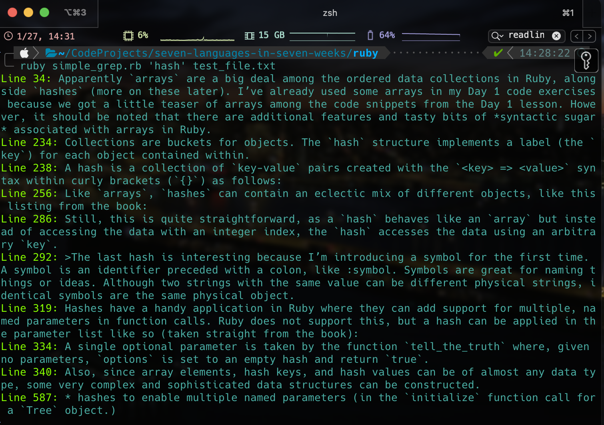

---

layout: post
title: Seven Languages - Day 2 - Ruby
Category: Programming
tags: [ Ruby, Seven Languages, Programming, Learning, Files, Classes ]
description: >
    Notebook from my second day of learning Ruby from <u>Seven Languages in Seven Weeks</u> by Bruce A. Tate.
---

**Language 1:  Ruby**

**Day 2:**

Here we go again! 

At the end of [Day 1](https://jjradler.github.io/blog/2025-01-21-seven-languages-seven-weeks-ruby-day1/) it felt very empowering to feel like I could build a program that does something — even if that thing is silly. 

Now I think things are about to get more serious in terms of probing the more powerful Object-Oriented (OO) features of Ruby.

**Functions:**

A function can be written right on the `irb` console (much like in Python for my fellow Pythonistas out there) as follows: 

``` ruby
irb(main):001* def tell_the_truth
irb(main):002*   true
irb(main):003> end
=> :tell_the_truth

```

Just like with Python, the `def` keyword is used to start the function, however unlike many of the other languages I’ve used, no parameters or parentheses are required to define the function. The `end` keyword is *required* to complete the function definition. 

As a quick aside, I think the colon (`:`) in front of the function name `:tell_the_truth`  is probably going to be important later.

To use the function, just invoke it in the `irb` REPL like so: 

``` ruby
irb(main):004> tell_the_truth
=> true
```

*Every function returns something.* If an explicit `return` is not given, the value returned will be the last expression evaluated before exiting the function scope. 

Functions are also objects, just like everything else in Ruby! 

There’s no doubt *much, much more* to learn about functions, passing parameters, passing functions *as parameters*, etc. but I will be patient… for now! 

---

**Arrays:**

Apparently `arrays` are a big deal among the ordered data collections in Ruby, alongside `hashes` (more on these later). I’ve already used some arrays in my Day 1 code exercises because we got a little teaser of arrays among the code snippets from the Day 1 lesson. However, it should be noted that there are additional features and tasty bits of *syntactic sugar* associated with arrays in Ruby. 

Examples of arrays are: 

```ruby
irb(main):005> animals = ['lions', 'tigers', 'bears']
=> ["lions", "tigers", "bears"]
irb(main):006> puts animals
lions
tigers
bears
=> nil
```

Array indexing works similarly to pretty much every other language, which is comforting and familiar: 

``` ruby
irb(main):007> animals[1]
=> "tigers"
irb(main):008> animals[0]
=> "lions"
irb(main):009> animals[-2]
=> "tigers"
irb(main):010> animals[-1]
=> "bears"

```

Note also that the *negative indexes* are, in similar fashion to Python again, will yield the values from the *end* of the array. This feature is a good example of the previously mentioned *syntactic sugar*.

What is *not* an example of syntactic sugar, however, is a `Range` object in Ruby. A `Range` is similar to the concept of an array slice in other languages at first glance. 

``` ruby
# now for some Ranges behaving like array slices.
irb(main):011> animals[0..1]
=> ["lions", "tigers"]
irb(main):012> animals[1..2]
=> ["tigers", "bears"]
# note that (1..2) has a different class.
irb(main):014> (1..2).class
=> Range
```

A `Range`, `(X..Y)` means all values from the first value `X` to the second value `Y` <u>inclusive</u>. 

Arrays can hold all sorts of datatypes, including other `array` objects, producing multi-dimensional arrays. There are some gotchas to be aware of with arrays, however. 

Arrays, being objects, will have methods of course! As with the number `4` we saw previously, the `*.class` method is available for an array. Trying it on array `a`:

``` ruby
irb(main):001> a.class
(irb):1:in '<main>': undefined local variable or method 'a' for main (NameError)
	from <internal:kernel>:168:in 'Kernel#loop'
	from /usr/local/Cellar/ruby/3.4.1/lib/ruby/gems/3.4.0/gems/irb-1.14.3/exe/irb:9:in '<top (required)>'
	from /usr/local/opt/ruby/bin/irb:25:in 'Kernel#load'
	from /usr/local/opt/ruby/bin/irb:25:in '<main>'
```

… produces an error since I haven’t told `irb` that I’m declaring it as an array. What about implying that it’s an array by declaring the first element to be `0`? 

``` ruby
irb(main):003> a[0] = 0
(irb):3:in '<main>': undefined local variable or method 'a' for main (NameError)
	from <internal:kernel>:168:in 'Kernel#loop'
	from /usr/local/Cellar/ruby/3.4.1/lib/ruby/gems/3.4.0/gems/irb-1.14.3/exe/irb:9:in '<top (required)>'
	from /usr/local/opt/ruby/bin/irb:25:in 'Kernel#load'
	from /usr/local/opt/ruby/bin/irb:25:in '<main>'
```

Nope! It will evidently need initialization as an empty array first before we can explore what is inside. However, initializing it is super easy: 

``` ruby 
# plonk that element down in those square brackets and you got yourself an array!
irb(main):006> a = [0]
=> [0]
# see? 
irb(main):007> a.class
=> Array
# you could also just use an empty pair o' brackets to define an empty array. Which is good, because these are indeed useful!
irb(main):008> a = []
=> []
irb(main):009> a.class
=> Array
irb(main):010> [].class
=> Array
```

It seems `[]` and `[]=` are methods of the `array` class, as indicated in `irb` with

``` ruby
irb(main):014> [1].methods.include?(:[])
=> true
irb(main):015> [1].methods.include?(:[]=)
=> true
```

These also qualify as syntactic sugar allowing access to the array structure. However, to use that sweet, sweet sugar, the array needs to be initialized first.

``` ruby
irb(main):025> a = []
=> []
irb(main):026> a.class
=> Array
irb(main):027> a.methods.include?(:[])
=> true
```

Another useful feature of arrays in Ruby is that they do not need to be homogeneous (i.e., all the same datatype, or even the same shape.)

``` ruby
irb(main):016> a[0] = 'zero'
=> "zero"
irb(main):017> a[1] = 1
=> 1
irb(main):018> a[2] = ['two', 'things']
=> ["two", "things"]
# viewing the array structure now that it's populated: 
irb(main):020> a
=> ["zero", 1, ["two", "things"]]
```

Furthermore, multiple-dimensional arrays can be created by embedding arrays within another array and the i-jth element ($a_{ij}$) can be accessed using the `a[i][j]` syntax, like in many other languages.. 

``` ruby
irb(main):021> a = [[1, 2, 3], [10, 20, 30], [40, 50, 60]]
=> [[1, 2, 3], [10, 20, 30], [40, 50, 60]]
irb(main):022> a[0][0]
=> 1
irb(main):023> a[2][2]
=> 60
```

OK, so what happens if we attempt to access an element outside the defined array? 

``` ruby
irb(main):024> a[3][3]
(irb):24:in '<main>': undefined method '[]' for nil (NoMethodError)
	from <internal:kernel>:168:in 'Kernel#loop'
	from /usr/local/Cellar/ruby/3.4.1/lib/ruby/gems/3.4.0/gems/irb-1.14.3/exe/irb:9:in '<top (required)>'
	from /usr/local/opt/ruby/bin/irb:25:in 'Kernel#load'
	from /usr/local/opt/ruby/bin/irb:25:in '<main>'
```

Ah, that’s comforting. It means you can’t run over the bounds of the array you defined or the interpreter will complain. 

How about slicing a multidimensional array?  I need to do this a lot in my Python code: 

``` ruby
a = [[1, 2, 3], [10, 20, 30], [40, 50, 60]]
=> [[1, 2, 3], [10, 20, 30], [40, 50, 60]]

# this is a slice to return a subset of the array.
a[1,2]
=> [[10, 20, 30], [40, 50, 60]]

# and this is an element-wise index access. 
a[1][2]
=> 30

```


It also turns out there are handy features in the `array` collection API that enable the construction of queues, linked lists, stacks, or sets. Here’s an example of a stack structure:

``` ruby
# define a stack as an empty array
irb(main):038> stack = []
=> []
# the *.push(value) method pushes value to the stack.
irb(main):039> stack.push(1)
=> [1]
# do it again.
irb(main):040> stack.push(2)
=> [1, 2]
# now the *.pop method returns the last-in-first-out value (2 in this case)
irb(main):041> stack.pop
=> 2
# now let's push a new arbitrary value, say 345.
irb(main):042> stack.push(345)
=> [1, 345]
# popping it off again...
irb(main):043> stack.pop
=> 345
# now let's pop the last value in the stack
irb(main):044> stack.pop
=> 1
# and we're left right where we started! 
irb(main):045> stack
=> []
```

So that’s pretty nifty, I would say! Seems like a nice structure for LIFO data buffers, too. 

Arrays also have iterator methods (like `*.each` and `*reverse_each`) that we might discuss a bit later for implementing things like queues and buffers. 

---

**Hashes:**

Collections are buckets for objects. The `hash` structure implements a label (the `key`) for each object contained within. 

Pythonistas, think about `Dict` structures. 

A hash is a collection of `key-value` pairs created with the `<key> => <value>` syntax within curly brackets (`{}`) as follows: 

``` ruby
irb(main):050> numbers = {1 => 'one', 2 => 'two'}
=> {1 => "one", 2 => "two"}
irb(main):051> numbers.class
=> Hash
```

The values can be retrieved using a similar syntax to arrays, like this: 

``` ruby
irb(main):053> numbers[1]
=> "one"
irb(main):054> numbers[2]
=> "two"
```

Like `arrays`, `hashes` can contain an eclectic mix of different objects, like this listing from the book: 

``` ruby
irb(main):055> stuff = {:array => [1, 2, 3], :string => 'Hi, Mom!'}
=> {array: [1, 2, 3], string: "Hi, Mom!"}
```

(This is a bit of a preview of the `:symbol` syntactic feature in Ruby, I think.)

Retrieving these values is straightforward, 

``` ruby
irb(main):057> stuff[:string]
=> "Hi, Mom!"
```

But, wait, what if we omit the `:` before `string`?

``` ruby
irb(main):056> stuff[string]
(irb):56:in '<main>': undefined local variable or method 'string' for main (NameError)
Did you mean?  String
	from <internal:kernel>:168:in 'Kernel#loop'
	from /usr/local/Cellar/ruby/3.4.1/lib/ruby/gems/3.4.0/gems/irb-1.14.3/exe/irb:9:in '<top (required)>'
	from /usr/local/opt/ruby/bin/irb:25:in 'Kernel#load'
	from /usr/local/opt/ruby/bin/irb:25:in '<main>'
```

Ah, interesting. Clearly there is a distinction between `string` and `:string` in this context. Stay tuned to figure out why! 

Still, this is quite straightforward, as a `hash` behaves like an `array` but instead of accessing the data with an integer index, the `hash` accesses the data using an arbitrary `key`. 

**Symbols (A Sidebar):**

Here we go! The book says:

>The last hash is interesting because I’m introducing a symbol for the first time. A symbol is an identifier preceded with a colon, like :symbol. Symbols are great for naming things or ideas. Although two strings with the same value can be different physical strings, identical symbols are the same physical object.

Tate, Bruce. Seven Languages in Seven Weeks: A Pragmatic Guide to Learning Programming Languages (Pragmatic Programmers) (p. 49). (Function). Kindle Edition. 

The example given in the book shows that an object’s ID (as I understand it, it’s unique place where it lives in the system memory?): 

``` ruby
irb(main):058> 'string'.object_id
=> 414704
irb(main):059> 'string'.object_id
=> 424112
irb(main):060> ':string'.object_id
=> 434136
irb(main):061> :string.object_id
=> 3891468
irb(main):062> :string.object_id
=> 3891468
```

Notice the ID numbers for the <u>Symbol</u> `:string` are identical indicating the reference to symbol `:string` "lives" in the same memory location. Meanwhile, the return values for `*.object_id` when the method is applied to `'string'` are all different, indicating that they “live” in different locations in the system memory. 

Symbols are a handy way to name and label objects in Ruby. 


**Now Back to Hashes!**

Hashes have a handy application in Ruby where they can add support for multiple, named parameters in function calls. Ruby does not support this, but a hash can be applied in the parameter list like so (taken straight from the book): 

``` ruby
irb(main):063* def tell_the_truth(options={})
irb(main):064*   if options[:profession] == :lawyer
irb(main):065*     'it could be believed that this is almost certainly not false.'
irb(main):066*   else
irb(main):067*     true
irb(main):068*   end
irb(main):069> end
=> :tell_the_truth
irb(main):070> tell_the_truth( :profession => :lawyer)
=> "it could be believed that this is almost certainly not false."
```

A single optional parameter is taken by the function `tell_the_truth` where, given no parameters, `options` is set to an empty hash and return `true`. 

Passing in `:profession` of `:lawyer` will produce a different result, printing the custom output string. Interestingly, the system will still evaluate this as `true`. 

Note that the braces in the input parameters are optional in this case. 

Also, since array elements, hash keys, and hash values can be of almost any data type, some very complex and sophisticated data structures can be constructed. 

---

**Code Blocks and Yield:**

A code block is a function without a name which is able to be passed as a parameter into a function or method. The book gives this example:

``` ruby
irb(main):071> 3.times {puts 'hiya there, kiddo.'}
hiya there, kiddo.
hiya there, kiddo.
hiya there, kiddo.
=> 3
```

The code between the braces (`{}`) is  a `code block`. The `*.times` is a method of `Integer` (the book says `Fixnum`, but this version of Ruby classes it as an `Integer`) that does `something` some `number` of times when `something` is a code block and `number` is the value of `Integer`. 

Code blocks can be specified with `{}` or `do ... end` where the convention is for one-liner code blocks to use braces and for multi-line blocks using the `do ... end` syntax. 

Here is an example of each syntax form: 

`{}` form: 

``` ruby
# braces notation.
irb(main):077> animals = ['lions and', 'tigers and', 'bears', 'oh my!']
=> ["lions and", "tigers and", "bears", "oh my!"]
irb(main):078> animals.each {|a| puts a}
lions and
tigers and
bears
oh my!
=> ["lions and", "tigers and", "bears", "oh my!"]
```

and `do ... end` form: 

``` ruby
# do ... end notation using the *.reverse_each method, just 'cause. 
irb(main):080* animals.reverse_each do
irb(main):081*   |a| puts a
irb(main):082> end
oh my!
bears
tigers and
lions and
=> ["lions and", "tigers and", "bears", "oh my!"]
```

Code blocks are neat because they can simplify the iteration of a single-use chunk of code without having to formalize it into a named function. 

The code in this last example iterated over each of the elements, printing each one, while essentially using an expressive, one-liner statement. 

The book now provides a custom implementation of the `*.times` method. *Note: I’ve updated it to use the Integer class instead of Fixnum to reflect changes in the structure of Numerics, but this is otherwise identical to the book.*: 

``` ruby
irb(main):094* class Integer
irb(main):095*   def my_times
irb(main):096*     i = self
irb(main):097*     while i > 0
irb(main):098*       i = i - 1
irb(main):099*       yield
irb(main):100*     end
irb(main):101*   end
irb(main):102> end
=> :my_times
irb(main):103> 3.my_times {puts 'mangy_moose'}
mangy_moose
mangy_moose
mangy_moose
=> nil
```

Note also that it’s possible to add custom methods to a Ruby built-in object (at least within the scope of the current runtime?) This can be done directly from the `irb` REPL! I can’t say I’ve done something like that before. It’s pretty neat. 


The method called `my_times` loops a set number of times given by the `Integer`, referenced with `self` within the method — remember that this is a method of the `Integer` class object, the number `3` – and invokes the code block with the `yield` keyword.

Another illustrative example from the book demonstrates how `code blocks` can be *first-class parameters*:

``` ruby
irb(main):104* def call_block(&block)
irb(main):105*   block.call
irb(main):106> end
=> :call_block
irb(main):107* def pass_block(&block)
irb(main):108*   call_block(&block)
irb(main):109> end
=> :pass_block
irb(main):110> pass_block {puts 'Hello, block'}
Hello, block
=> nil
```

Ok, so what’s happening here? No doubt, you noticed the `&` prefix on `&block`. Those of you who know `C` might get flashbacks to pointers and pass-by-reference. 

*An Aside:* Perhaps this is similar, where the reference to `block` is provided by the `&` prefix? What’s this button do…? Let’s pop the hood on the `call_block` function we defined above: 

```ruby
irb(main):123* def call_block(&block)
irb(main):124*   puts block.class
irb(main):125*   puts block.call.class
irb(main):126*   block.call
irb(main):127> end
=> :call_block
irb(main):128> pass_block {puts "testing"}
Proc
testing
NilClass
testing
=> nil
```

Ok, so we get a `Proc` (a process, I assume?), which makes sense. A `NilClass` object is returned as the `*.class` for the method `block.call`. 

What happens if we trace the `*.object_id` for `block` within `call_block`?

``` ruby
irb(main):133* def call_block(&block)
irb(main):134*   puts block.object_id
irb(main):135*   block.call
irb(main):136> end
=> :call_block
irb(main):137* def pass_block(&block)
irb(main):138*   puts block.object_id
irb(main):139*   call_block(&block)
irb(main):140> end
=> :pass_block
irb(main):141> pass_block {puts 'This is the block.'}
1842000
1842000
This is the block.
=> nil
```

Oh cool, the `object_id` for the `&block` object must refer to the object with the same ID number through the call stack, which must correspond to the `Proc` type object `block`.  If I’m wrong, please correct me, but I think I know how this works now!

Anyway… 

Techniques like passing around executable code blocks as `Proc` objects are quite useful, and not just for iteration! 

The book gives another example of delayed execution using `code blocks`:

``` ruby
execute_at_noon { puts 'beep beep.... time to get up!'}
```

Another example will conditionally execute something:

``` ruby
... some code ...

in_case_of_emergency do
  use_credit_card
  panic
end

def in_case_of_emergency
  yield if emergency?
end

... more code ... 
```

… or enforce a policy: 

```ruby
within_a_transaction do
  things_that
  must_happen_together
end

def within_a_transaction
  begin_transaction
  yield
	end_transaction
end
```

These examples make it clear that the `yield` keyword within a function will take the code block in the function parameter will execute the code block in question… essentially serving as a place-holder for an arbitrary code block within a sequence of other tasks – this is particularly clear in the last example, I think. 

According to the book, there are many Ruby libraries that use blocks to process each line of a file, do work within an HTTP transaction, and do complex operations over collections.  I imagine this can get quite sophisticated. 

---

**Defining Classes:**

Ruby has classes and objects as one would expect from a purely OO language. Classes serve as templates while objects are the actual products made from the templates. There can only be one instance of the class, but many instances of objects *made from* the class template can be spawned in a given context in general. Still, I am sure there are patterns for enforcing singletons, etc. (is this what Symbols are for?)

Unlike `C++`, a Ruby `class` *can only inherit from just <u>one</u> parent class* called a `superclass`. 

`Object` – (inherits properties from) –> `Module` – (inherits from) -> `Class`

and for a specific object, like number `4`, we see that

`4` – is a(n) –> `Integer` – is a –> `Numeric` - is a -> `Class` 

More concretely, 

``` ruby
irb(main):143> 4.class.class
=> Class
irb(main):144> 4.class.class.superclass
=> Module
irb(main):145> 4.class.class.superclass.superclass
=> Object

# whereas
irb(main):147> 4.class
=> Integer
irb(main):149> 4.class.superclass
=> Numeric
irb(main):150> 4.class.superclass.superclass
=> Object
```

`4` is an `Integer`. `Integer` is an instance of class `Class`, which inherits data and properties from `Module`, which inherits data and properties from `Object`. 

Essentially, the object model in Ruby is a tree with `Object` as the common ancestor for all objects in the language. 

To illustrate this, the book provides this listing of the source code for `Tree` class definition from `ruby/tree.rb`: 

```ruby
class Tree
  attr_accessor :children 
  attr_accessor :node_name
  
  def initialize(name, children=[])
    @children = children
    @node_name = name
  end
  
  def visit_all(&block)
    visit &block
    children.each {|c| c.visit_all &block}
  end
  
  def visit(&block)
    block.call self
  end
end
```

You’ll notice this listing has a little bit of basically everything we’ve worked with in this section:

* hashes to enable multiple named parameters (in the `initialize` function call for a `Tree` object.)
* code blocks and passing code blocks between methods of `Tree` (note the `&block` parameters.)
* iterators using `self` like the `*.times` method on `Integer`
* and probably a few more patterns, structures, and syntax features I’m missing right now. 

as well as a few new things that can be done with these structures like *recursion*. 

It’s a pretty great illustration of the power of code blocks, that’s for sure.

It implements a simple tree data structure with three methods: 

1. `initialize`
2. `visit`
3. `visit_all`

and two *instance variables*: 

1.  `children`
2. `node_name`

The `initialize` method has a special meaning in Ruby – it will be called automatically by the interpreter when Ruby instantiates (creates) an instance of the `Tree` class `object`. 

The `initialize` method in this listing provides the starting values for `children` and `node_name`, where the `visit` method calls the inbound code block. `visit_all’ calls `visit` for the node and recursively calls it again for each of the children. 

**QUICK FACTS!**

Here’s a few new things to note about Ruby at this point as well: 

1.  Classes are typically `CamelCase` by convention.
2.  Instance variables are prepended with `@` (with one value per *object* but it can be different between different instances of the same class)
3. Class variables are prepended with `@@`, which will be only one value *across all instances of the class in question!*
4.  Constants are denoted in `ALL_CAPS`. 
5. Instance variables and method names begin with lowercase letters in the `underscore_style`. 
6. Every `Tree` class object built-in has two instance variables: `@children` and `@node_name`. 
7. Functions and methods that test values or state use a question mark (i.e., `if test?`). 
8. The `attr` keyword defines an instance variable. Several versions exist, 
   1. where `attr` defines an instance variable and a method of the same name to access it
   2. or `attr_accessor` where an instance variable is defined as well as an accessor (a “getter”) and a setter. 

The bottom portion of the listing is as follows:

``` ruby
ruby_tree = Tree.new( "Ruby", 
  [Tree.new("Reia"), Tree.new("MacRuby")] )

puts "visiting a node"

ruby_tree.visit {|node| puts node.node_name}

puts

puts "visiting entire tree"
ruby_tree.visit_all {|node| puts node.node_name}
```

which uses the API for `Tree` to create a new tree called “Ruby” with two child nodes “Reia” and “MacRuby”. Then a single node is visited (the top level node “Ruby”). Subsequently all nodes are visited and their names printed to the console. 

---

**Mixin Classes and How To Write Them:**

OO languages use inheritance to propagate behavior to similar objects (i.e., inherited methods from superclasses). When the behaviors between a superclass and a class, either inheritance can be allowed from more than one class (multiple inheritance) or you can find another solution. 

Ruby does not use multiple inheritance out of the box, which is alright by me because multiple inheritance can get really, really ugly as a codebase grows. What’s more, The Internet assures me it is one of the most popular ways to shoot oneself in the foot with OO programming. 

Ruby uses the concept of *modules*. A `module` is a collection of functions and constants. When you include a module as part of a class, those behaviors and constants also become part of the class. 

For example (from the book):

```ruby
# ruby/to_file.rb
module ToFile
  def filename
    "object_#(self.object_id).txt"
  end
  
  def to_f
    File.open(filename, 'w') {|f| f.write(to_s)}
  end
  
end
```

The module definition provides two functions/methods. The `to_f` method writes the output of the `to_s` method to a file with a filename supplied by the `filename` method. 

Interestingly, `to_s` is used in the module but *is not implemented until we define it in the class below!* 

This implies that a module will interact with the including class at an intimate level, often depending on several class methods. 

Note that with Ruby, this contract and coupling between the method and class is implicitly handled with the interpreter’s *duck typing* (see Day 1!). 

Now, we can include this module in a class, let’s call it `Person' and define it as so:

``` ruby
class Person
  
  include ToFile
  
  attr_accessor :name
  
  def initialize(name)
    @name = name
  end
  
  def to_s
    name
  end
  
end
```

The `Person` class is boring, but it does include the `module` we discussed above.  However, now we can implement the class `Person`, using the `*.to_f` function (as a method, now!) provided by the `module` `ToFile` as: 

``` ruby
Person.new('matz').to_f
```

The `Person` class basically includes the `ToFile` module, and that’s pretty much it. The capability to write the person object’s contents to file is carried into `Person` with the `include` statement and the tight coupling between the module and the class. 

This technique is called implementing a *mixin*. New mixins and subclasses can be added to Person as needed, and each subclass of Person will have access to the functions (through inheritance) introduced into its parent `superclass`. 

This means a simplified single-inheritance model can be used to define the essential parts of a class, but additional features can be thrown into the “mix” using a *mixin*. This style of programming promises to keep inheritance simple but provide nice packaging of behaviors.

---

**Modules, Enumerable, and Sets:**

Now that we’ve talked about mixins, we can discuss `enumerable` and `comparable` mixins. A class wanting to be an `enumerable` must implement the `*.each` method at a bare minimum. A class intending to be `comparable` must implement the *spaceship operator*, `<=>`. 

An object of a comparable class must be able to be compared with another object, where the comparison will evaluate `a <=> b` which returns `-1` if `b > a`, `1` if `a > b`, and `0` otherwise. 

Enumerables and comparables will provide other convenience methods for collections. For example: 

``` ruby
irb(main):153> a = [5, 3, 4, 1]
=> [5, 3, 4, 1]
irb(main):154> a.sort
=> [1, 3, 4, 5]
irb(main):155>
irb(main):156> a.any? {|i| i > 6}
=> false
irb(main):157> a.any? {|i| i > 4}
=> true
irb(main):158> a.all? {|i| i > 4}
=> false
irb(main):159> a.all? {|i| i > 0}
=> true
irb(main):160> a.collect {|i| i * 2}
=> [10, 6, 8, 2]
irb(main):161> a.select {|i| i % 2 == 0}
=> [4]
irb(main):162> a.select {|i| i % 2 == 1}
=> [5, 3, 1]
irb(main):163> a.max
=> 5
irb(main):164> a.min
=> 1
irb(main):165> a.member?(2)
=> false
```

`*.any?` will return `true` if the condition in the code block is true for *any of the elements in the array*. 

`*.all?` will return `true` if the condition in the code block is true for *all elements in the array*. 

Since the spaceship operator is implemented for each item in the array (all elements are of class `Integer`), the elements can be sorted or `min` and `max` can be computed. 

Set-based operations include `collect` and `map`, which apply the function provided in the associated code block to *each element* in the array, returning a copy of the array with the operation applied. 

The `find` method will find exactly one element matching the condition in the code block, whereas `find_all` and `select` will return all elements matching the condition. 

Another interesting method on the array (as an enumerable & comparable) is the `*.inject` method, which will compute a sum or product of all elements in the array as follows: 

``` ruby
irb(main):166> a = [5, 3, 4, 1]
=> [5, 3, 4, 1]
irb(main):167> a.inject(0) {|sum, i| sum + i}
=> 13
irb(main):168> a.inject {|sum, i| sum + i}
=> 13
irb(main):169> a.inject {|product, i| product * i}
=> 60
```

`*.inject` will take a code block containing two arguments (operation and element index `i`), executing the operation on each item in the list with `inject` passing each list element to the code block as the second argument (`i`). The first argument is the the result of the previous iteration of the code block. 

The “result” won’t have a value for the first iteration, so you pass in the initial value as an argument to `inject`. 

*Note: If the initial value for `inject` is not specified, it will select the first element in the collection and carry on iteration from there.*

This is illustrated more clearly with the following listing from the book, specifying an initial value at index 0: 

``` ruby
irb(main):170* a.inject(0) do |sum, i|
irb(main):171*   puts "sum: #{sum}  i: #{i}   sum + i: #{sum + i}"
irb(main):172*   sum + i
irb(main):173> end
sum: 0  i: 5   sum + i: 5
sum: 5  i: 3   sum + i: 8
sum: 8  i: 4   sum + i: 12
sum: 12  i: 1   sum + i: 13
=> 13
```

and again getting the same result *without specifying the initial value index as an argument to `inject`*: 

``` ruby
irb(main):174* a.inject do |sum, i|
irb(main):175*   puts "sum: #{sum}  i: #{i}   sum + i: #{sum + i}"
irb(main):176*   sum + i
irb(main):177> end
sum: 5  i: 3   sum + i: 8
sum: 8  i: 4   sum + i: 12
sum: 12  i: 1   sum + i: 13
=> 13
```

`inject` is handy for computing the word count of many sentences, find the largest word in a paragraph, or some similar problem where large quantities of text or numbers need to be parsed. This feature of Ruby seems like a good way to do a lot of annoying work quickly with minimal lines of code. 

---

**Wrapping Up Day 2:**

We got that sweet taste of syntactic sugar, a bit of iterator wizardry, and some insight into the flexibility of the Ruby language. Collections are super simple: two collection types with APIs adding behavior flexibly and with features enabling customization of the each collection’s behaviors. Single-inheritance and clever applications of mixins highlight the ways that one can modify object behavior with a minimal number of holes through the metaphorical foot. 

Surely there is more crazy stuff to come that really makes Ruby stand out. Time for exercises and to see if we retained what we learned! 

---

**Day 2 Self-Study:**

**Find & Answer:**

*1. Find out how to access files with and without code blocks. What is the benefit of the code block?*

There are multiple ways to do things in Ruby as I am finding out. Without code blocks, a file can be accessed and something can be done using a `do...end` statement where the whole file is loaded and for each line in the file, a block is executed. 

``` ruby
# a method familiar to most people in every language is to open 
# the File class object and do something with it. 
# This takes three lines. 
>> File.open('file.txt') do |file|
  file.each_line {|line| puts line}
end
```

With code blocks, the file can be accessed and manipulated with a more terse syntax. 

```ruby
File.foreach('file.txt') {|line| puts line}
```

The code block offers the benefit of brevity and simplicity as well as allowing for iterating over the file without reading the entire file into memory at one time, which can be a game-changer with large text files or directories that need to be searched for a specific pattern-match (foreshadowing?)


*2. How would you translate a hash into an array?  Can you translate arrays to hashes?*

An array could be considered a special, reduced case of a hash where the keys are simply the index integer values of the array. Similarly, an array could be expanded into a hash by assigning the indices as keys.

*Edit:* An even simpler method is to use the `<hash>.to_a` method to represent the `hash` in an `array` format! However, this only goes down one key-value pair layer. If the hash is *nested* it will still return an array element that is of datatype `Hash` for that element. An approach for tackling a nested hash structure might be to run `*.to_a` within the code block of a `*.collect` method call on the top-level hash structure. I should play around with this a bit more.

 Always learning around here. 


*3. Can you iterate through a `hash`?*

Yes, you just need the key to access the values. An example of this might be:

``` ruby 
 cat = {:name => 'Fuzz', :weight => '11 lbs', :color => 'orange', :status => 'legend', :weight_class => 'chungis'}
cat.each do |key, value| 
  puts "Fuzz\'s #{key} is #{value}."
end
```

which will give us the result: 

``` ruby
Fuzz's name is Fuzz
Fuzz's weight is 11 lbs
Fuzz's color is orange
Fuzz's status is legend
Fuzz's weight_class is chungis
=> {name: "Fuzz", weight: "11 lbs", color: "orange", status: "legend", weight_class: "chungis"}
```


*4. You can use Ruby arrays as stacks. What other common data structures do arrays support?*

Arrays will support queues and buffers using the `push` and `pop` methods combined with `shift` and `unshift` methods. 

<u>Stacks</u> use the `*.push()` and `*.pop` methods to push elements to the *end* of the array and pop them off the stack in reverse-order (Last-In-First-Out).

<u>Queues</u> could be implemented (a first-in-last-out structure) using a combination of `*unshift()` and `*.pop`, with new data arriving at array index 0 and the oldest (first-in) data popping off the end of the queue as a return value from `*.pop`.

It also seems like linked lists could be implemented if the class `Integer` is modified at runtime to also include the link address or object ID of the next object object in the array.  


**Do & Build:**

*1a. Print the contents of an array of sixteen numbers, four numbers at a time, using just `*.each`.*

First, let’s construct the array programmatically in the REPL: 

``` ruby
irb(main):235> i = 0
=> 0
irb(main):236> a = []
=> []
irb(main):237* 16.times do
irb(main):238*   a.push(2 * i)
irb(main):239*   i = i + 1
irb(main):240> end
=> 16
irb(main):241> a
=> [0, 2, 4, 6, 8, 10, 12, 14, 16, 18, 20, 22, 24, 26, 28, 30]
```

Now we need to output four numbers per output row using just `*.each`:

``` ruby
irb(main):290> j = 0
=> 0
irb(main):291> a.each {|element| puts "#{a[j-3]}, #{a[j-2]}, #{a[j-1]}, #{a[j]}" if ((j + 1) % 4 == 0); j = j + 1}
0, 2, 4, 6
8, 10, 12, 14
16, 18, 20, 22
24, 26, 28, 30
=> [0, 2, 4, 6, 8, 10, 12, 14, 16, 18, 20, 22, 24, 26, 28, 30]
```

Using the modulus is the classic way to solve this class of problem, but be careful to re-initialize the counting index `j` before using this one-liner. 


*1b. Now, do the same with `*.each_slice` in `Enumerable`.*

```ruby
irb(main):298> a.each_slice(4) {|a| print "#{a}\n|"}
[0, 2, 4, 6]
|[8, 10, 12, 14]
|[16, 18, 20, 22]
|[24, 26, 28, 30]
|=> [0, 2, 4, 6, 8, 10, 12, 14, 16, 18, 20, 22, 24, 26, 28, 30]
```

Golly, that was easier… although I had to use the `print` method or the `p` method to get the slices formatted correctly. 


*2. The `Tree` class was interesting, but it did not allow you to specify a new tree with a clean user interface. Let the initializer accept a nested structure of hashes. You should be able to specify a tree like this: `{'grandpa' => {'dad' => {'child 1' => {}, 'child 2' => {} }, 'uncle' => {'child 3' => {}, 'child 4' => {} } } }`.*

The first thing we need to do is unpack the top-level hash and convert it into an array of a [`string`, `children_hash`] at the top level. 

```ruby
irb(main):021> nested_hash = {'grandpa' => {'dad' => {'child 1' => {}, 'child 2' => {} }, 'uncle' => {'child 3' => {}, 'child 4' => {} } } }
=>
{"grandpa" =>
    ...

irb(main):023> nested_hash.keys
=> ["grandpa"]
irb(main):032> nested_hash.values[0].keys
=> ["dad", "uncle"]
```

Ok, lets probe the properties of these structures a bit: 

``` ruby
irb(main):004> nested_hash['grandpa'].keys.class
=> Array
irb(main):005> nested_hash['grandpa'].values.class
=> Array
```

The trick for making this work is using a method we only tangentially touched on earlier:  `*.collect`.  `*.collect` is also an alias for `*.map` according to the Ruby API documentation. 

``` ruby
#tree_nested_input.rb
class Tree
  attr_accessor :children
  attr_accessor :node_name

  def initialize(nested_hash={})
    @node_name = nested_hash.keys[0]
    # the trick here is to use the `.collect` method to iterate as it accepts
    # both the `array` and `hash` class methods. Using `.each` throws an error.
    @children = nested_hash[node_name].collect{|k, v| Tree.new(k => v)}
  end

  def visit_all(&block)
    visit &block
    children.each {|c| c.visit_all &block}
  end

  def visit(&block)
    block.call self
  end
end
```

Then we can run the code at the bottom of `tree_nested_input.rb` that looks like this: 

```ruby
nested_hash_family = {'grandpa' => {'dad' => {'child_1' => {}, 'child_2' => {} }, 'uncle' => {'child_1' => {}, 'child_2' => {} } } }

ruby_tree = Tree.new(nested_hash_family)

puts "visiting a node"

ruby_tree.visit {|node| puts node.node_name}

puts "Visiting entire tree."
ruby_tree.visit_all {|node| puts "Name: #{node.node_name} children: #{node.children}"}
```

Running this whole listing results in the following console output. 

``` shell
$ ruby tree_nested_input.rb
visiting a node
grandpa
Visiting entire tree.
Name: grandpa children: [#<Tree:0x0000000109472480 @node_name="dad", @children=[#<Tree:0x0000000109472188 @node_name="child_1", @children=[]>, #<Tree:0x0000000109471d50 @node_name="child_2", @children=[]>]>, #<Tree:0x0000000109471bc0 @node_name="uncle", @children=[#<Tree:0x00000001094718c8 @node_name="child_1", @children=[]>, #<Tree:0x00000001094717b0 @node_name="child_2", @children=[]>]>]
Name: dad children: [#<Tree:0x0000000109472188 @node_name="child_1", @children=[]>, #<Tree:0x0000000109471d50 @node_name="child_2", @children=[]>]
Name: child_1 children: []
Name: child_2 children: []
Name: uncle children: [#<Tree:0x00000001094718c8 @node_name="child_1", @children=[]>, #<Tree:0x00000001094717b0 @node_name="child_2", @children=[]>]
Name: child_1 children: []
Name: child_2 children: []
```


*3. Write a simple `grep` that will print the lines of a file having any occurrences of a phrase anywhere in that line. You will need to do a simple regular expression match and read lines from a file. (This is surprisingly simple in Ruby.) If you want, include line numbers in the output.*

Following the discussion from above about opening and writing files, the simplest solution in as few lines of code as possible seems best here. To accomplish this, the `File` class or `IO` class method. According to the documentation for [`Ruby Std-lib 2.5.5`](https://ruby-doc.org/core-2.5.5/IO.html), the `File` class is the only standard subclass of `IO` and they are closely associated. Therefore, for the purposes of this exercise I would consider the `IO` or `File` classes to be interchangeable for the purposes of using the `*.readlines` method in `Ruby >= 2.5.5`. 

Also, it seems best to run this from a file, so this will be written in `grep.rb` in the same directory (for now) as our test file, called `test_file.txt`. 

For this example, I will just use a portion of the text from this very blog post in plaintext form to search for patterns, but this code is generalizable to other files as we use the array of input arguments (much like C, C++, or Python):  `ARGV[i]` where we would invoke the simple `grep` program as: `ruby grep.rb <regex_pattern> <file_name>` where our `<regex_pattern>` is a `Regex` (regular expression) string representing the pattern we want to find in file `<file_name>`. 

The line index will be provided using the handy `*.each_with_index` method which yields a pair of objects in the iterative code block, `line` and `index`.

We will also need to use a pattern-matching tool. In the (Ruby documentation for `Regexp`)[https://ruby-doc.org/core-2.5.8/Regexp.html] I found the `=~` operator, which is Ruby’s basic pattern match operator. In simple cases it seems to be at least roughly equivalent to applying the `Regex#match` method. It’s usage is `<String> =~ <regex_pattern>` where the return value is `nil` for no match and the `Integer` index of the pattern within the string otherwise. 

``` ruby
regex_pattern = ARGV[0]
file_name = ARGV[1]

File.readlines(file_name).each_with_index {|line, index| puts "Line #{index + 1}: #{line}" if line =~ /#{regex_pattern}/}
```

Finally, once I got it working, just for a little fun I added some colors to the terminal to make the line numbers easier to read (for me at least). There is a guide for how to do this very simply using the `puts` method in Ruby [here](https://dev.to/joshdevhub/terminal-colors-using-ruby-410p). 

``` ruby
regex_pattern = ARGV[0]
file_name = ARGV[1]

# \e[38;5;118m#{text}\e[0m changed the color to a bright yellow on my dark terminal background.
File.readlines(file_name).each_with_index {|line, index| puts "\e[38;5;118mLine #{index + 1}:\e[0m #{line}" if line =~ /#{regex_pattern}/}
```

Running this on `test_file.txt` produces the output (where I was using a dark terminal background in iTerm2) : 



It looks like it works great, at least for basic alphanumeric searches!

---


**Closing out Day 2:**

So, there was a *lot* of exploration of the ever-important iterators and object structures. I can see it being a real challenge trying to figure out how to order the subsections in units like this one for languages like Ruby. 

It’s all very powerful, but also very interconnected with the underlying properties of `objects` in Ruby in general. 

This was especially apparent when we got into talking about trees, classes, modules, their interactions and intimacy, and the mixin style of programming as a workaround to single-inheritance in Ruby. 

Everything built up on the previous discussion, but there are always niggling questions about how something might be related to another thing in Ruby. I’ve noticed this is a theme in OO languages and language features, but they also seem quite powerful in the right hands! 

I will say this though – the author of this book put a lot of thought into focusing on the aspects of Ruby that one should learn to really understand what makes Ruby “tick” in order to support master later on. It’s refreshing – like studying a foreign language grammar and syntax instead of exclusively memorizing phrases and vocabulary words.

Next on the agenda is the *last* day of Ruby for this crash-course:  metaprogramming! 

---

