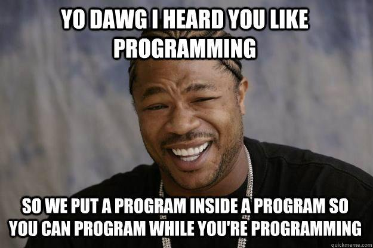

---

layout: post
title: Seven Languages - Day 3 - Ruby
Category: Programming
tags: [ Ruby, Seven Languages, Programming, Learning, Metaprogramming ]
description: >
    Notebook from my third and last day of learning Ruby from <u>Seven Languages in Seven Weeks</u> by Bruce A. Tate.
---

**Language 1:  Ruby**

**Day 3:**

OK! Take a deep breath… this is the last day of Ruby before we move on to the `Io` programming language, which should prove very interesting! 

At the end of [Day 2](https://jjradler.github.io/blog/2025-01-23-seven-languages-seven-weeks-ruby-day2/) we saw some neat ways to interact with data structures, take in data from files and pull patterns out of them – even implementing a very simple version of a *very* powerful tool in the Linux Command Line (`grep`) in Ruby. 

This last day seems like it might be the most challenging so far, because now we’re getting into *metaprogramming*, revisiting *modules*, and looking at some more complex and powerful techniques in Ruby before we close out this language section. 

First, a personal sidenote:  I mentioned in my [Introductory post](https://jjradler.github.io/blog/2025-01-20-seven-languages-seven-weeks-introduction/), it bears repeating that the purpose of this series is for me to “put my code out there” again and to publicly hold myself accountable for completing these exercises. 

Also, I am making a special point to not just directly copy over the wonderful writing of Bruce Tate. Rather, I am attempting to digest, paraphrawse, and reinterpret the book. At some points I am also updating some of the syntax in the listings so it will still work with the version of Ruby that I am using. 

*I think you should read the book for yourself instead of only relying on my perspective and writings and treating these posts as a substitute for the original source material!.*

Still, I do sincerely hope someone out there finds these posts helpful, but at the very least they will serve as a handy reference for me going forward as I continue learning these languages and programming as a craft. 

Anyway, back to business: 

---

**So… Metaprogramming?:**

Sounds a bit weird, no? 

The book suggests this is, however, one of the keys to the magic of Ruby. *Metaprogramming* is defined in this book as “Writing programs that write programs.”

So that seems pretty straightforward, semantically. But what does this mean in the context of Ruby? 

In this section, there are examples given from the [`Rails`](https://rubyonrails.org) framework. Specifically, an example of metaprogramming given in the book is the `ActiveRecord` framework that is the centerpiece of [`Rails`](https://rubyonrails.org). `ActiveRecord` uses metaprogramming to implement a language (within the language!) for building classes linked to database tables (hence the name!). 

An `ActiveRecord` class for a `Department` might look like: 

```ruby
class Department < ActiveRecord::Base
  has_many :employees
  has_one	 :manager
end
```

where `has_many` and `has_one` are Ruby methods that add all the instance variables and methods needed to establish a “has_many” relationship.

The purpose of this is I think, in part, to provide a more human-readable, English-like syntax for carrying out the build of a class to a given spec.

The class specification also eliminates other noise, baggage, and boilerplate needed for other database frameworks. 

So how does one *do* this magical metaprogramming!?


**Open Classes (We’ve met these already):**

Open classes allow for a change to the definition of the class at any time, typically to add behavior (remember mixins in [Day 2](https://jjradler.github.io/blog/2025-01-23-seven-languages-seven-weeks-ruby-day2/)?). These structures have been alluded to somewhat obliquely over the last two Days of study, but I think now we’ll take them head-on. 

From the book, here’s an example that adds a method to `NilClass` in the `Rails` framework. 

```ruby
# ruby/blank.rb
class NilClass
  def blank?
    true
  end
end

class String
  def blank?
    self.size == 0
  end
end

# I decided I liked the one-liner version better than the do ... end version.
["", "person", nil].each {|element| puts element unless element.blank?}
```

In Ruby, the first invocation of a `class` defines the class.

However, *subsequent invocations of the `class` will modify the class*, as we see in the listing above. 

In the Ruby standard library implmented in the current version of `irb`, we can see that value `nil` is a member of `NilClass`. 

```ruby
irb(main):001> nil.class
=> NilClass
```

In the listing modifying `NilClass` <u>by invoking the class again</u>, the `*.blank?` method is implemented on `NilClass` and returns `true` in the case of a `NilClass` object with the modification defined by re-invoking the class in the code of `ruby/blank.rb`. 

This seems trivial because of course a `NilClass` object is “blank”. However, this technique can be extended to another class to add functionality for checking if the container is empty (or, again, blank). 

We see from the standard library implementation of `irb` that an empty (blank, if you will) `String` returns that it is a string. But how would we know it is blank? 

```ruby
irb(main):003> "".class
=> String
irb(main):004> "".blank?
(irb):4:in '<main>': undefined method 'blank?' for an instance of String (NoMethodError)
	from <internal:kernel>:168:in 'Kernel#loop'
	from /usr/local/Cellar/ruby/3.4.1/lib/ruby/gems/3.4.0/gems/irb-1.14.3/exe/irb:9:in '<top (required)>'
	from /usr/local/opt/ruby/bin/irb:25:in 'Kernel#load'
	from /usr/local/opt/ruby/bin/irb:25:in '<main>'
```

The interpreter clearly doesn’t know that the string is blank. So we modify the `String` class to include the `*.blank?` method.

Re-invoking the `String` class to include a `*.blank?` method enables some additional functionality. What I would like to do is have a simple call to the `*.blank?` method of `String` class objects to test for *two different cases of blanks* that a `String` may satisfy. Namely, the case where the value of `String` is `“”` or `nil`. This is satisfied when the condition `self.size == 0`, returning `true` for a blank `String`. We see this in the `String` invocation in the example listing, reprinted here for convenience: 

``` ruby 
class String
  def blank?
    self.size == 0
  end
end
```

But why does this idiom return `true` for both `“”` and `nil` value conditions? 

This is a consequence of “duck typing” that we discussed in the very first day of this journey:  it doesn’t matter which class `String` is pointing to so long as it supports the `*.blank?` method. If it does, the interpreter will surmise that it walks like a duck, quacks like a duck, and therefore must be a duck. More concretely, if it looks like a ‘nil’ or other object with behavior like that of `nil` (like an array of `length==0`, then it must be `nil`, and therefore the condition is met and the `*.blank?` method will return `true` for our modified `String` object.

We have now added additional functionality to an object defined in the standard library of Ruby so it will behave in a way that is convenient for our purposes.

The output from running this in the console is:

``` shell
$ ruby blank.rb
person
```

which proves the point that `“”` and `nil` both return `true` for the condition satisfying `*.blank?`. 

So what’s happening here? Ruby provides the capability to redefine standard library behavior or really the behaviors of other classes we might need to work with by re-invoking them in our own code. This seems *incredibly* powerful – we can impose our will on the behavior of objects in the standard library or implemented in other APIs in Ruby. However, with such a sharp tool, we need to be careful to not stab ourselves or lose a metaphorical finger. 

It is entirely possible to completely disable Ruby itself with the wrong redefinition of a `class`, say `Class.new` (do NOT try this.) In programming we of course call this “shooting ourselves in the foot”. We need to be <u>very careful</u> where we are aiming this powerful tool.

Open classes are useful in particular for creating Domain Specific Languages (DSL), where the language syntax or features need to be extended in a specific way to tailor it to a specific business domain. A good example of this is a listing given in the book that provides an API that expresses all distances as inches: 

```ruby
# ruby/units.rb
class Numeric
  def inches
    self
  end
  
  def feet
    self * 12.inches
  end
  
  def yards
    self * 3.feet
  end
  
  def miles
    self. * 5280.feet
  end
  
  def back
    self * -1
  end
  
  def forward
    self
  end
end


# testing it out...
puts 10.miles.back
puts 2.feet.forward
```

We have redefined the `Numeric` class (a reminder that this includes *all numbers* from now on) in our application to <u>include functionality for converting any number to inches!</u>

Open classes made that possible! 

The flip-side of this incredible possibility for destruction is the creation of very readable and flexible code. Great freedom is possible with this language feature. However, it might also make a larger codebase a waking-nightmare to debug as the behavior of even familiar classes can be changed on-the-fly. 

So what does this have to do with metaprogramming?  It opens the door for writing code that modifies itself and generates other code in a programmatic way. Still more powerful features exist in Ruby to facilitate metaprogramming. 

Powerful stuff, indeed!  

**method_missing:**

Ruby calls a special debugging method each time a method is missing to print diagnostic information. It feels like a hack, but *overriding this method* allows additional behavior to be built into an application. 

Another book example involves an API to represent Roman numerals. 

This could be done easily with a method call using an API like `Roman.number_for "ii"` which is still usable and a simple enough solution. However, with Ruby this can be made even better using the following listing: 

``` ruby
# roman.rb
class Roman
  def self.method_missing name, *args
    roman = name.to_s
    # change the edge-case values to something easier to count
    roman.gsub!("IV", "IIII")
    roman.gsub!("IX", "VIIII")
    roman.gsub!("XL", "XXXX")
    roman.gsub!("XC", "LXXXX")
    # now perform the symbol counts.
    (roman.count("I") + 
      roman.count("V") * 5 + 
      roman.count("X") * 10 + 
      roman.count("L") * 50 + 
      roman.count("C") * 100)
  end
end

# Now testing it out: 
puts Roman.X
puts Roman.XC
puts Roman.XII
puts Roman.IV
puts Roman.IX
```

Notes on this listing: 

* The `method_missing` method is overridden in the class invocation. 
* The name of the method and its parameters are taken as input parameters, but in this implementation we are only interested in the `name`, which would correspond to the `.X` or `.<roman_numeral>` suffix in the method calls (at the bottom of the listing). 
* The method name (*e.g.,* `IX`) is converted to a string using the `*.to_s` method. 
* Then we convert the harder-to-count edge-case Roman numerals (*i.e.,* 4s and 9s and their equivalents for each addition of 10, etc.) into something more easily counted in an iterator. This is accomplished with the `String.gsub!` method which returns a copy of the `String` object with *all occurrences of the pattern (first argument)  substituted for the second argument*. 
* Also note that the usage of the bang `!` in the `*.gsub!` method has no direct meaning to the interpreter and is used as a convention by Ruby developers to annotate a potentially “dangerous” method. 
* At this point, the `String.count` method is called which returns an `Integer` value for the number of occurrences of the pattern passed in as an input argument. Pretty straightforward and very readable syntax! 

Ok, so testing it out… 

```shell
$ ruby roman.rb
10
90
12
4
9
```

We see that it works just fine! 

However, there is a cost here as well — this class is more difficult to debug because now we have occupied the `method_missing` method with another implementation! Therefore, this technique should be used sparingly and carefully. We definitely want to have strong error checking implemented to make sure it was accepting valid Roman numerals because it might be a real challenge to find the implementation of the `.IX` method (or for whatever number) on `Roman` unless you knew where to look. 

---

**Modules Redux!:**

Another metaprogramming style in Ruby is the module. A few lines of code in a module can implement `def` or `attr_accessor` to extend classes. You can also extend classes in aother ways, including defining a Domain Specific Language (DSL) to define the class. 

The DSL defines methods in a module that adds other methods and constants needed to manage a class. 

The book now uses a common superclass to illustrate the type of class one might build through metaprogramming. It opens a CSV file based on the name of the class.

```ruby
# acts_as_csv_class.rb
class ActsAsCsv
  def read
    file = File.new(self.class.to_s.downcase + '.txt')
    @headers = file.gets.chomp.split(', ')
    file.each do |row|
      @result << row.chomp.split(', ')
    end
  end
  
  def headers
    @headers
  end
  
  def csv_contents
    @result
  end
  
  def initialize
    @result = []
    read
  end
end

class RubyCsv < ActsAsCsv 
end

m = RubyCsv.new
puts m.headers.inspect
puts m.csv_contents.inspect

```


A few new things to note here that we may not have discussed yet: 

* the `file.gets` method reads the next line from the open file. Lines are separated by a `sep` where a `sep` set to `nil` reads the entire contents. A zero-length separator reads the input a paragraph at a time (where two successive newlines separates the paragraphs.)
* the `*.chomp` method strips newlines from the string `file.gets`
* the `<<` operator in the context of `@result << row.chomp.split(', ')`. It is called the “shovel” or “push” operator, which is a method and has different behavior depending on context. For `Arrays`, it is an alias of the `push` method. In our context with `String` objects, it will append the operand to the end of the array (`@result`). 
* Setting the class `RubyCsv < ActsAsCsv` subclasses `RubyCsv` from `ActsAsCsv`, causing it to inherit all the functionality defined in the invocation of `ActsAsCsv`. 

The basic class `ActsAsCsv` defines four methods: `headers` and `csv_contents` are accessor methods that return the value of the instance variables; `initialize` initializes the results of the file read. Most of the work happens in `read` which as defined here opens a file, reads headings, then chops them into individual fields. Then `read` will loop over lines, placing the contents of each line into the `@results` array. 

It doesn’t handle edge cases or check inputs at all, but it is designed as an illustrative example. 

Next, let’s modify the file where we defined the class (`acts_as_csv_class.rb`) to attach behavior to the class with a module method called a *macro*. Macros change the behavior of classes based on changes in the environment. In the example, the macro opens up the class and places all the behavior related to a CSV file inside.

```ruby
# acts_as_csv.rb
class ActsAsCsv
  def self.acts_as_csv
    define_method 'read' do
      file = File.new(self.class.to_s.downcase + '.txt')
      @headers = file.gets.chomp.split(', ')
      file.each do |row|
        @result << row.chomp.split(', ')
      end
    end
    
    define_method "headers" do
      @headers
    end
    
    define_method "csv_contents" do
      @result
    end
    
    define_method 'initialize' do
      @result = []
      read
    end
    
  end
  
end

class RubyCsv < ActsAsCsv
  acts_as_csv
end


m = RubyCsv.new
puts m.headers.inspect
puts m.csv_contents.inspect
```

This looks remarkably similar to our class definition for `ActsAsCsv` above, doesn’t it? Note that the definition has execution statements after `define_method`. The `acts_as_csv` statement within the inheritance structure for `RubyCsv` extends `RubyCsv` through metaprogramming to include the functionality defined in `ActsAsCsv`. Essentially, the `acts_as_csv` macro adds the methods and attributes defined within `self.acts_as_csv` when the statement `acts_as_csv` is executed within its invocation. 

So now we can use a class mixin with a module (as we discussed in Day 2) to extend the functionality through the `include` keyword. 

``` ruby
# acts_as_csv_module.rb
module ActsAsCsv
  def self.included(base)
    base.extend ClassMethods
  end
  
  module ClassMethods
    def acts_as_csv
      include InstanceMethods
    end
  end
  
  module InstanceMethods
    def read
      @csv_contents = []
      filename = self.class.to_s_.downcase + '.txt'
      file = File.new(filename)
      @headers = file.gets.chomp.split(', ')
      file.each do |row|
        @csv_contents << row.chomp.split(', ')
      end
    end
    
    attr_accessor :headers
    attr_accessor :csv_contents
    def initialize
      read
    end
    
  end
  
end

class RubyCsv # no inheritance, it gets mixed in with include! 
  include ActsAsCsv
  acts_as_csv
end

m = RubyCsv.new
puts m.headers.inspect
puts m.csv_contents.inspect
m.each {|row| puts row.one}
 
```

Ruby will invoke the `included` method whenever the module gets included into another with the `include` statement (simple, right?) The target class is called `base` (`RubyCsv`) which is extended when the module adds the class methods to `RubyCsv`. The only class method is `acts_as_csv` which in turn opens up the class and includes all the instant methods. 

We’ve written an automated program within a program! 



This functionality allows the creation of classes that change their methods and attributes when placed in different contexts. This seems a bit slippery and hard to debug – because it probably is – but it also provides the capability to abstract a great deal of complex state-based and contextual business logic away from having to hand-write out every single case explicitly. 

As another example of this capability, ActiveRecord in Rails uses metaprogramming to <u>dynamically add accessors that are the same name as the columns of the database</u>. Some XML frameworks like `builder` let users define custom tags using `method_missing` to simplify the syntax. Simpler, prettier syntax can make readers and users of your code get past the quirks of syntax and get closer to the intention of the code. 

Heady stuff! No wonder so many tools and frameworks have been written using Ruby over the years. 

---

**Day 3 Summary:**

Some very powerful techniques can be used in Ruby for computers writing computer programs, which is a bit mind-bending if one thinks about it too hard or for too long. We discussed three primary metaprogramming techniques: 

1. Open Classes - Modifying API or library classes in-place by re-invoking them explicitly. Functionality like adding attributes or methods can be directly added this way. However, it seems like a good way to make a very gnarly debugging problem if this technique is overused. 
2. Using the `method_missing` method contained in every class. This one feels a bit like a hack, but it’s very satisfying when you can get it to work correctly. A big downside here is the removal of a very helpful debugging technique for your overall Ruby application. Sparing usage of this technique is recommended. 
3. The most popular and (probably?) the safest and easiest way to implement metaprogramming is by extending the functionality of classes with modules. The `include` feature allows us to create the Ruby equivalent of mixin classes without violating the single-inheritance requirement of the Ruby language. 

---

**Day 3 Self-Study:**

*Modify the CSV application to support an `each` method to return a `CsvRow` object. Use `method_missing` on that `CsvRow` to return the value for the column for a given heading name.*

*For example, for the file:*

``````
one, two, 
lions, tigers
``````

*allow an API that works like this:*

``` ruby
csv = RubyCsv.new
csv.each {|row| puts row.one}
```

*which should print `lions`.*

Solution: 

The solution that seems most immediately apparent is to use the example with `Roman` class Roman numerals where the accessors are implemented using `method_missing`. Synthesizing the `method_missing` technique with adding an `.each` method from `Enumerable` (maybe through `incude`?) using the module macro metaprogramming technique should produce the added functionality we seek. 

There are a number of approaches one could take. We could create a child class with added functionality for `Array` or create a new class, maybe `CsvRow`?

First, we need to construct the `method_missing` logic to dynamically create the accessor. We also need to allow the row to accept a code block. This can be accomplished by defining this class within the scope of the larger `ActsAsCsv` class. 

``` ruby
...
  class CsvRow
    def initialize(headers, row_array)
      @headers = headers
      @data = row_array
    end
    
    def method_missing name, *args, &block
      #locate the value based on the index.
      index = @headers.index(name.to_s)
      # return the data at index @csv_contents[row, @index]
      @data[index]	
    end
  end
... 

```

Then we need to introduce this structure in place of the original `Array` class rows in `ActsAsCsv`. 

``` ruby
# acts_as_csv_module.rb
module ActsAsCsv
  def self.included(base)
    base.extend ClassMethods
  end

  module ClassMethods
    def acts_as_csv
      include InstanceMethods
      include Enumerable
    end
  end

  module InstanceMethods
    attr_accessor :headers
    attr_accessor :csv_contents

    def initialize
      read
    end

    def read
      @csv_contents = []
      filename = self.class.to_s.downcase + '.txt'

      file = File.new(filename)
      @headers = to_array(file.gets)

      file.each do |row|
        @csv_contents << CsvRow.new(@headers, to_array(row))
      end
    end

    def to_array(row)
      row.chomp.split(', ')
    end

    class CsvRow
      def initialize(headers, row_array)
        @headers = headers
        @data = row_array
      end

      def method_missing name, *args, &block
        index = @headers.index(name.to_s)
        @data[index]
      end
    end
  end
end

class RubyCsv # no inheritance, it gets mixed in with include!
  include ActsAsCsv
  acts_as_csv
end

m = RubyCsv.new
puts m.headers.inspect
puts m.csv_contents.inspect 
```

So far so good. This works as expected. Now the last step is to sort out the `.each` method implementation for each row. This requires adding the `*.each` method that is able to call a code block. It iterates down each column where the column is named dynamically based on the header. 

We’ll also change the small test script at the bottom of the listing to reflect these changes. 

``` ruby
# acts_as_csv_module.rb
module ActsAsCsv
  def self.included(base)
    base.extend ClassMethods
  end

  module ClassMethods
    def acts_as_csv
      include InstanceMethods
      include Enumerable
    end
  end

  module InstanceMethods
    attr_accessor :headers
    attr_accessor :csv_contents

    def initialize
      read
    end

    def read
      @csv_contents = []
      filename = self.class.to_s.downcase + '.txt'
      file = File.new(filename)
      @headers = to_array(file.gets)

      file.each do |row|
        @csv_contents << CsvRow.new(@headers, to_array(row))
      end
    end

    def to_array(row)
      row.chomp.split(', ')
    end

    def each(&block)
      # note the trick of using yield here!
      @csv_contents.each { |row| yield row }
    end

    class CsvRow
      def initialize(headers, row_array)
        @headers = headers
        @row_data = row_array
      end

      def method_missing name, *args
        index = @headers.find_index(name.to_s)
        # puts "Row header index #{index}"
        @row_data[index]
      end
    end
  end
end

class RubyCsv # no inheritance, it gets mixed in with include!
  include ActsAsCsv
  acts_as_csv
end


# now let's run some tests.
csv= RubyCsv.new
puts "Column One:"
csv.each { |row| puts row.one }
puts "Column Two:"
csv.each { |row| puts row.two }
puts "Success!"
```

For a slightly expanded test file, we have: 

``` .txt
one, two
lions, tigers
tigers, lions
bears, tigers
oh my, lions
```

The output we get from running this is: 

``` shell
$ ruby modified_acts_as_csv_module.rb
Column One:
lions
tigers
bears
oh my
Column Two:
tigers
lions
tigers
lions
Success!
```

Yay! That worked correctly, just as expected.  What a nifty set of tools! 

---

**Closing out Day 3 and Final Thoughts on Ruby:**

These three days of Ruby have made me feel a bit like the character Neo from The Matrix (1999). If you haven’t seen the film, I strongly recommend that you put aside some time to do so even though that is not relevant here. What *is* relevant is that Neo is able to have a cable plugged into his brain, has kung-fu loaded into his brain, and now “[he] knows kung-fu”. 


This whirlwind tour of the structure, basics, and then super-powerful techniques in Ruby has made me feel a bit like Neo. I have learned a great deal about data structures (particularly Ruby hashes) and metaprogramming in particular just through working on these blog posts.   

I will say that learning Ruby to a degree of proficiency needed to do the exercises *will* change how you view Object Oriented Programming as a whole. 

Coming from C and Python, I find Ruby to be *uncomfortably flexible* and capable of shifting its form. In the hands of a programmer thinking deeply about the object relationships in their code this attribute can be incredibly beautiful. However, it’s like a heavy, sharp chisel – you drop that sucker on your foot and you might be minus a few toes! 

*When I use Ruby it is like a being shut-in finally going outside into an open field with nobody around. It is a bit disorienting and unnerving, but I could definitely get used to it.*

According to the book (and my own limited experience with the language), Ruby can be summarized like this: 

<u>Core Strengths:</u>

* Objects can be treated in a uniform, consistent way. 
* Duck-typing allows truer polymorphic designs based on what the object itself can support rather than the inheritance hierarchy.
* Ruby’s modules and open classes let one attach behavior or syntax to extend the typical instance variable definitions for the class. 
* It is very productive and readable (once you’re familiar with the basic syntax) – although I’ll chime in and say that the large variety of different operator tokens is dizzing at times.
* There is very likely a recent Ruby distribution on your system right now that you can play with. 
* The package manager works well and there is a veritable cornucopia of available extensions and libraries on top of the standard library available through the `gem` package manager (these packages are called `Gem`s, even though we did not touch on them here.)

<u>Recommended Applications</u>

* It is very strong as glue logic and for crawling the Internet. 
* Local build environments and test harnesses are good applications for Ruby.
* It is an excellent scripting language. 
* It works well for parsing text and extracting data from various data representations. 
* Combining `Ruby` with `Rails` gives us `Ruby on Rails`, which is one of the most successful and popular web development frameworks of all time. 
* The many naming conventions for database and application elements allow an application to be buit with few lines of configuration. 
* Additional Ruby on Rails plugins exist to further extend the framework to suit a number of use cases.

<u>Weaknesses</u>

Ruby of course has its drawbacks just like every other language. Among those listed in the book are (including some of my own observations): 

* Speed/performance (allegedly, I haven’t benchmarked this yet, myself.)
* Type Safety: duck typing is often good enough, but the programmer still needs to keep track of their object data types, <u>especially given how they can change very easily during runtime.</u>
* Open classes, `method_missing` and metaprogramming can seriously backfire if they are overused. I imagine if one tries to get “too clever” or “too elegant” with these powerful tools, they can make a decently-sized application written in Ruby a nightmare to maintain. Documentation of metaprogramming strategies is going to be key here when implementing these techniques in Ruby. 

Is this the right tool for *every* job? Absolutely not, but it is an excellent tool to use when it is the right tool for the job. The whole point of learning other programming languages is to *avoid* being the metaphorical “guy who only has a hammer.”

Next up is the `Io` programming language – which I have zero experience with –  so I am both a bit apprehensive and very excited about it. We’ll be exploring it together.

 See you there! 


While we’re taking a short break, [check out this clip of Neo learning Kung Fu from The Matrix](https://www.youtube.com/watch?v=0YhJxJZOWBw).

---

