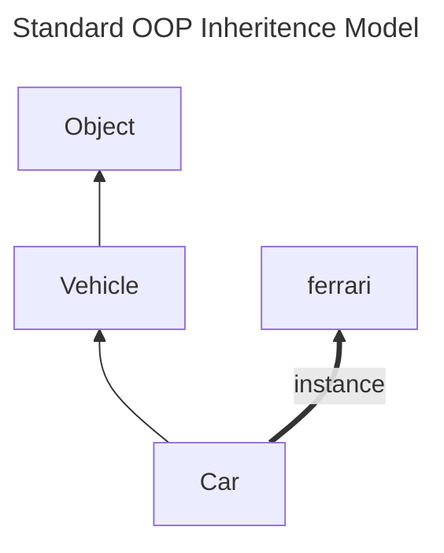
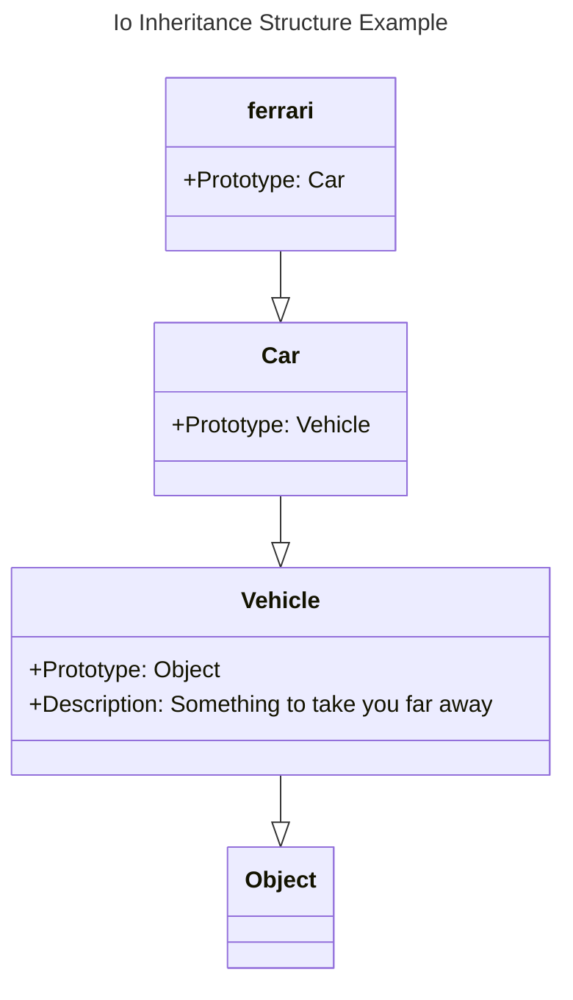

**Language 2:  Io**

**Day 4 - Introduction to Io (Io – Day 1):**

`Io` is an odd one, especially in 2025. It has a different programming model than I am used to. It is a descedent of `Self`, which was influenced by oddball symbolic language `APL` (which, fun fact, [requires its own special keyboard and layout](https://dfns.dyalog.com/n_keyboards.htm)) and `Smalltalk`, developed in the 1970s and released in 1980– so the ideas contained within `Io` have been around for a long while. 

Furthermore, it looks like it has not been used very much, but the creator of `Io`, Steve Dekorte, has generously taken the time to keep [updating the Io GitHub](https://github.com/IoLanguage/io) so it can at least be built from source on newer machines. It has been maintained for 23 years now, which I find impressive in its own right. 

It does also have a [gorgeous, minimal website](https://iolanguage.org), which – it might be shallow of me to admit – is encouraging. 

**Setting Up Io:**

It turns out much of my apprehension was misplaced, because I could install `Io` on my recently built Macbook Pro with Apple Silicon using the `*.dmg` image of the binary from the [Io website](https://iolanguage.org/binaries.html). It did need to use the “legacy installer”, but so far so good.

```shell
$ which io
/usr/local/bin/io
```

There it is! 

Let’s see if it runs…

``` shell
io
zsh: bad CPU type in executable: io
```

Oh rats! I guess I’ll try the other method suggested on the project’s GitHub – let’s try out a `brew` install…

```shell
$ brew install io
...
$ which io
/usr/local/bin/io
```

Ok, let’s try this again.

```shell
$ io
Io 20151111
Io>
```

Heck yeah! There’s my REPL prompt for `Io`. 

Note I also didn’t have to do any fancy footwork to specify the processor architecture, which is a pleasant surprise given what I read in the documentation.

Considering the age of the language and how ‘under the radar’ it is, I’m quite happy that it only took a few minutes to work out an installation. 

Thanks for putting it on `Homebrew`, Steve! 

----

**Getting to Know Io:**

The programming model is where things will get really interesting. `Io` is called a *prototype language*. There are no classes, only objects! Objects are created by cloning them from other <u>prototype objects</u> (I love it when the name of a concept is so straightforward!). 

The syntax is, I gather, very simple and minimal while remaining quite low-level. There will be little syntactic sugar here, friends! 

The syntax chains messages together, with each message returning an object and each message taking optional parameters in parentheses. <u>Everything in `Io` is a message that returns another receiver.</u>

There are no keywords.  

What? 

Right, there are *no keywords*. Only a handful of tokens that behave like keywords. 

All objects are generated from clones of prototypical objects, which is apparently as close to an object-oriented `Lisp` as one can get. 

According to the book (as I’m sure we’ll learn soon), the simplicity of the core language belies a set a libraries that extend the language. These libraries include: 

* Concurrency support
* Web frameworks
* Wikis
* Persistence and serialization
* Key/Value store
* Object Relational Mapping (ORM)
* A `rake`-like build system
* A multi-user unified network
* A library that generates chords(?!?)
* JSON pack/unpack
* A package manager
* And a testing framework like Ruby’s `rspec`

… among a few others.  

Whether support *still* exists for all of these with my current build of `Io` is another thing, but we’ll “burn that bridge when we get to it”.

According to the [`Io/reference` page](https://iolanguage.org/reference/index.html) there is also documentation support for accessing a number of useful APIs using `Io`. I’ll be sure to have a look at that more carefully later. 

**Io Dawg!:**

The classic way to get to know a language is to print the evergreen “Hello, World” string to the console with it. 

``` io
Io> "Hi, ho, Io!"
==> Hi, ho, Io!
Io> "Hello, World!"
==> Hello, World!
```

Sweet. Works like a charm. What else can we do with this contraption? 

---

**I Think I’m a Clone Now…:**

As a *prototype language*, `Io` creates objects from clones of other objects. This seems weird, but in a sense it might feel like cutting out the `class` middle-man. You ‘simply’ derive objects from other, similar objects.

There are a few rules to this technique we need to follow, though, and `Io` gives us a good sense of how this works. 

First, let’s make a vehicle. This requires the `clone` <u>message</u>, which you’ll note is applied as a postposition in the `Io` language: 

``` Io
Io> io
Io 20151111
Io> Vehicle := Object clone
==>  Vehicle_0x6000031053c0:
  type             = "Vehicle"
```

Here we’ve created a `Vehicle` from a generic `Object` defined by `Io` itself. `Object` is a *root-level object*. We send the `clone` message to the `Object`, uh…, object, *et voilà!* an object of *type* `Vehicle` appears in our workspace. 

The object that is cloned is assigned to `Vehicle`. Again, it isn’t a class, it’s not a template, it’s a bona fide object called `Vehicle` based on the `Object` prototype.

It sort of feels like the equipment locker in The Matrix (did you [take my advice](https://jjradler.github.io/blog/2025-01-27-seven-languages-seven-weeks-ruby-day3/) from my posts on Ruby and watch The Matrix?!?)


So now what can we do with `Io`?  Let’s explore more of `Io`'s rules about creating object clones. 

We can interact with objects, say, giving it a description. We can do this by *passing the message* `description` *to* `Vehicle` with the postposition syntax:

``` io
Io> Vehicle description := "Something to take you places."
==> Something to take you places.
```

Notice the use of the *walrus operator* (`:=`) instead of the typical assignment (`=`) operator. This is important to remember. 

So did `description` exist before we passed the `description := '...'` message?  

Nope.

It did, however, assign a name `description` to a structure in the `Vehicle` object called a `slot`. You can think of a slot as a <u>key-value pair</u>, where a collection of slots would constitute a `hash` in most other programming languages. If the slot you named (i.e., `description` in our example) does not yet exist, `Io` will create it for you on the object provided the *walrus operator* is used. If the regular *assignment* operator is used to define a slot, it will throw an error. 

In other words, the *walrus operator* (`:=`) will write a new slot complete with a new name.

```io
Io> Vehicle color := "Red"
==> Red
```

Meanwhile, the *assignment operator* (`=`) will only apply the message content if the slot already exists and has a name. 

``` io
Io> Vehicle color = "Red"

  Exception: Slot color not found. Must define slot using := operator before updating.
  ---------
  message 'updateSlot' in 'Command Line' on line 1
```

However, *if the slot already exists, it will reassign the value for you without additional comment!*: 

``` io
Io> Vehicle description
==> Something to take you places.
Io> Vehicle description = "Something to take you far away."
==> Something to take you far away.
Io> Vehicle description
==> Something to take you far away.
```

If we look at the structure of the language that has been shown to us so far, we find that the `Object` in `Io` seems to be *mostly a collection of slots with a name attached to it.*. 

Ok, cool, so what else can we do? 

Well, we can retrieve the values (it would be pretty pointless to assign them if we couldn’t…). The values in the slots are returned when the slot name is sent as a message: 

```io
Io> Vehicle color
==> Red
Io> Vehicle description
==> Something to take you far away.
```

Nifty. So now what? We’ve got an object we’ve customized in a somewhat trivial way – how can we look at the object and its structure? 

We can indeed do this with passing some standard library messages contained in `Io`, like the `slotNames` message. 

``` io
Io> Vehicle slotNames
==> list(color, type, description)
```

Sending this message to `Vehicle` yields a list of the names for each slot defined on the object. Note the `type` slot is included but we did not define it. Every `Object` in `Io` will support a `type` slot. 

``` io
Io> Vehicle type
==> Vehicle
Io> Object type
==> Object
```

Types are a whole subject we should discuss, but right now let’s consider `type` as the kind of object we’re working with, where a `type` <u> is an object and NOT a class<u/>.  

<u>There are NO classes in `Io`!</u>


So a quick recap of what we know about this language: 

* Objects can only be created by cloning other objects. 
* Objects basically amount to a labeled/named collection of slots.
* Slots are structurally very similar to key-value pairs in other object-oriented languages (like `dict` entries in Python or `hash` structures in Ruby, for example.)
* You can interact with objects by sending them messages. 
* An object will tell you all about itself if you send it the right messages. 

It’s got a very simple syntax and structure so far, but that initial impression can be quite decieving. Let’s see what depths we can plumb in the soul of `Io`.

---

**Objects, Prototypes, and Inheritance:**

So, given this is probably the most object-oriented object-oriented language you could have (objects are literally all we have to work with, after all!), one would assume there is some sort of inheritance mechanism in `Io`, and one would be correct! 

Let’s consider our `Vehicle` object again. Could we model another object, say, a `ferrari` as an instance of a car? 

In your typical object-oriented language, you would model it something like this: 



So in a prototype language, the flow is a little different. We would start by instantiating (cloning) the `Car` from `Vehicle`. Then we can update its description as we like. 




This is illustrated more concretely with the following experiment in the `Io` REPL: 

``` io
Io> Car := Vehicle clone
==>  Car_0x6000031a0b40:
  type             = "Car"

Io> Car slotNames
==> list(type)
Io> Car type
==> Car
```

Interestingly, the clone only explicity carries the slot `type` if we list the `slotNames`. Recall that when we pass the message `Vehicle slotNames` into `Vehicle` we see

```io
Io> Vehicle slotNames
==> list(color, type, description)
```

But `Car` is a clone of `Vehicle` isn’t it? Does it have some kind of *hidden* `description` slot? In `Io`, what we did was create a new object called `Car` by sending the `clone` message to its prototype, `Vehicle`.  If we send the `description` message to `Car`, what do we get?

```io
Io> Car description
==> Something to take you far away.
```

Weird, so it does have the `description` slot, but it doesn’t appear explicitly in `Car slotNames`.  Okay, so what does this mean? 

<u>It means that the `description` message is *forwarded* to the `Vehicle` prototype that `Car` was cloned from.</u> Instead of finding `description` on `Car`, it goes on to `Car`'s prototype, `Vehicle`, eventually finding the `description` slot. 

It’s very simple, a little counterintuitive, and seems like a useful feature of the language.

So now let’s make another car from the `Car` object through cloning, but this time it’s a ferrari: 

``` io
Io> ferrari := Car clone
==>  Car_0x6000031e9540:

Io> ferrari slotNames
==> list()
```

No `type` slot? No `description` slot?

``` io
Io> ferrari type
==> Car
```

Same deal, `ferrari` will *forward* the message `type` up to its prototype, `Car` until we get a result, `type ==> Car`. 

Notice the lowercase first letter of `ferrari`. This is important in `Io`. 

* When we cloned `Car`, it was an uppercase name for the clone object. This created another `type` (*i.e.,* `Car`) from the `type` `Vehicle`.
* When we cloned `ferrari` from `Car`, we did NOT create a new type. `ferrari type` remains `Car`.

By convention, types in `Io` begin with an *uppercase letter*. In the case of `ferrari`, when invoking the `type` slot, you see the type of the prototype, whereas in the case of `Car type` you get the type `Car` returned from the `type` message. 

Breaking down these rules a bit more: 

* Objects are just containers of slots. 
* Slots are returned by passing its name as a message to an object.
* If the slot isn’t there, `Io` calls the parent *prototype* of the object. 
* There are no classes or metaclasses to deal with here. 
* There are no interfaces or modules in `Io` in this context – only the objects themselves. 

Types in `Io` are just conveniences. Idiomatically, an uppercase named object in `Io` is also a `type` and has its type automatically assigned upon creation. 

Any daughter clones of a given type object that are labeled with lowercase names will simply invoke their parent’s `type` slot when a `type` message is passed to them. Types are tools for organizing the code, but they do not appear to carry much more semantic meaning as far as the interpreter is concerned. 

If you wanted to create a `ferrari` type, you would have it begin with an uppercase letter: 

``` io
Io> Ferrari := Car clone
==>  Ferrari_0x6000031c7f00:
  type             = "Ferrari"

Io> Ferrari type
==> Ferrari
```

Now, investigating the slot names of `Ferrari`, 

```io
Io> Ferrari slotNames
==> list(type)
Io> ferrari slotNames
==> list()
```

We see that the new `type` called `Ferrari` has a `slotName` of `type` generated automagically by `Io`. 

As we’ve alluded to previously, this is in contrast with other Object Oriented languages like Ruby or Java where classes are *templates* for objects, not the objects themselves. In Ruby for example, 

``` ruby
bruce = Person.new
```

creates a new `person` object from the specifications (template) of the `Person` class defined elsewhere in the program. These are entirely different entities in the Ruby code.

By contrast, in `Io` we would create a `clone` of the `Person` called `bruce` as

``` io
bruce := Person clone
```

which creates a *clone called `bruce`* from the `Person` prototype object. The object `bruce` would in fact return `bruce type => Person`, and both `bruce` and `Person` are objects in the workspace, but `bruce` does not have an inherent type. Instead, `bruce` will pass the `type` message back up to `Person`, where `Person` *does* indeed have a `type`, namely `Person`. 

This is a bit different from any other language I’ve ever used, myself, but it’s a lot of fun to play with in the REPL. Let’s see what else we can do! 

---

**Methods:**

Methods can be created in `Io` simply, using the following syntax:

``` io
Io> method("So, you've come for an argument." println)
==> method(
    "So, you've come for an argument." println
)
```

A method is an object just like everything else in `Io`. Like any other type of object, you can get its type by passing it the `type` message. 

```io
Io> method type
==> Block
Io> method() type
==> Block
```

Being objects, methods can also be assigned to a `slot` on an object in `Io`: 

``` io
Io> Car drive := method("Vroom!" println)
==> method(
    "Vroom!" println
)
```

What’s neat here, is that the prototype mechanics of `Io` make it possible for the clones of the `Car` object to access the method behavior of the method slot we just added. Check this out: 

``` io
Io> ferrari drive
Vroom!
==> Vroom!
```

Recall that `ferrari` is a clone of `Car`. Just as with the `type` message, when we invoke the method `drive` using the `drive` message on `ferrari` we see it exhibit the behavior we slotted into `Car`. 

Cool! This actually feels a lot simpler and cleaner than some of the inheritance mechanisms in Python or Ruby. I’m sure there’s some gotchas and complexities I have not seen yet, but so far I’m digging it. 

According to the book, we now know the core organizational principles and structures of `Io`.  It’s so tiny and minimalist. I love it! 

Now that we can define types and objects, we can add data and behavior to an object by assigning content to its slots and leveraging the inheritance mechanism of cloning. Everything else we need to do involves using `Io`'s libraries. 

Going deeper into this, though, we can start to do things like retrieving the contents of slots regardless of type using the `getSlot` message, like so: 

``` io
Io> ferrari getSlot("drive")
==> method(
    "Vroom!" println
)
```

Neat! Just like other messages in `Io`, the `getSlot` message will be forwarded up to the object’s prototype if the slot doesn’t already exist on the object in question. Remember, we have not made ANY changes to the `ferrari` object, we have only modified the slot structure of `Car`, from which it was cloned! 

Similarly, the prototype of any object can be returned in `Io` with the `proto` message: 

``` io
Io> ferrari proto
==>  Car_0x6000012f5f80:
  drive            = method(...)
  type             = "Car"
  
```

and the same can be done with `Car`: 

``` io
Io> Car proto
==>  Vehicle_0x6000012dde00:
  description      = "Something to take you far away."
  type             = "Vehicle"
  
```

Their custom slots are also displayed when using the `proto` message, which is convenient. Very thoughtful! 

---

**Let’s all go to the Lobby!:**

It turns out there is also a master namespace called `Lobby` that contains all the named objects. All of the assignments we have done so far are listed plus a few more built-in objects for the session. Look at this!

``` io
Io> Lobby
==>  Object_0x600001290bc0:
  Car              = Car_0x6000012f5f80
  Lobby            = Object_0x600001290bc0
  Protos           = Object_0x600001290b40
  Vehicle          = Vehicle_0x6000012dde00
  _                = Object_0x600001290bc0
  exit             = method(...)
  ferrari          = Car_0x6000012e6cc0
  forward          = method(...)
  set_             = method(...)

```

We see an implementation of `exit`, `forward`, `Protos`, and the things we defined on top of the session. It also appears that the `Lobby` itself is an object and we are just slots working on objects in slots working on objects working on slots…

…

… Anyway! It looks like we have explored the programming paradigm enough to make it clear how it works around these parts. Here are the basic rules distilled once again: 

* Everything is an object. I mean *everything*. 
* Every *interaction* between objects is called a *message*. 
* You don’t instantiate classes – you clone other objects from their *prototypes*. 
* This is key: *Objects remember their prototypes.*
* Objects have slots. Some are automatic by convention. 
* A message returns the value in a slot or invokes a method living in the slot. 
* If an object can’t respond to a message, it will forward that message up to its prototype (“I’ll let you speak to my manager…”). 

Since we can see or change any slot or object, some complex metaprogramming is possible with `Io` as well (this thing again!). 

But wait, don’t we need stuff like *collections* to do useful stuff, or is this just a toy? 

Fear not! For we are on to… 

---

**Lists and Maps:**

There are some collections built into `Io`. 

* Lists: these are <u>ordered</u> collections of objects of *any type*. `List` is the prototype for *all lists*. 
* Maps: these are collections of key-value pairs. `Map` is the prototype for all key-value pairs like Ruby `Hash` structures or `Dicts` in Python. 

Lists can be created like this: 

``` io
Io> toDos := list("Find my car.", "find Continuum Transfunctioner.", "Get banished to Hoboken, New Jersey.")
==> list(Find my car., find Continuum Transfunctioner., Get banished to Hoboken, New Jersey.)
```

There are some built in behaviors associated with `List` objects, like `size` and `append`. Let’s experiment with those: 

``` io
Io> toDos size
==> 3
Io> toDos append("Find a present!")
==> list(Find my car., find Continuum Transfunctioner., Get banished to Hoboken, New Jersey., Find a present!)
```

There is also a shortcut for representing a list. `Object` supports the `list` method, which will wrap all the arguments up into a list (is this a *tiny* taste of syntactic sugar, after all!?!). 

``` io
Io> list(1, 2, 3, 4)
==> list(1, 2, 3, 4)
```

`List` also contains slots with handy built-in behaviors. Let’s see what we can find by passing `slotNames` to the `List` object:  

``` io
Io> List slotNames
==> list(second, removeFirst, swapIndices, sortByKey, containsIdenticalTo, pop, containsAny, contains, itemCopy, empty, third, mapFromKey, detect, asMessage, removeSeq, union, rest, reverseReduce, groupBy, removeAll, setSize, asString, appendSeq, indexOf, containsAll, atInsert, justSerialized, with, intersect, at, appendIfAbsent, max, atPut, ListCursor, min, join, foreach, sort, difference, cursor, asMap, first, sum, append, last, reverseInPlace, removeAt, asSimpleString, insertBefore, preallocateToSize, flatten, select, selectInPlace, asEncodedList, unique, size, sortInPlaceBy, sortKey, mapInPlace, isNotEmpty, remove, map, slice, copy, push, reduce, sortBy, insertAt, uniqueCount, reverseForeach, sortInPlace, asJson, sliceInPlace, prepend, exSlice, average, insertAfter, removeLast, capacity, reverse, isEmpty, fromEncodedList)
```

Oh cool, that’s actually quite a few! There are some method slots that clearly add functionilty to support data structures like queues (`push`, `pop`) and some other mathematical methods(did you see there’s an `average`, a `sum`, `min` and `max` methods?). 

In addition to handy list manipulation methods like `isEmpty` or `join`, here are some cool iterative and search methods as well built right in, like `at`, `select`, `indexOf`, and a bunch more. 

Here are some examples from the book to showcase some of these built-in behaviors: 

```io
Io> list(1,2,3,4) average
==> 2.5
Io> list(1,2,3,4) sum
==> 10
Io> list(1,2,3) append(4)
==> list(1, 2, 3, 4)
Io> list(1,2,3) pop
==> 3
Io> list(1,2,3) push(4)
==> list(1, 2, 3, 4)
Io> list(1,2,3) prepend(0)
==> list(0, 1, 2, 3)
Io> list() isEmpty
==> true
```

Lists in `Io` seem pretty powerful and straightforward to use. It’s certainly nice that we can peek inside the behavior slots so easily from the REPL. 

So what about `Map` objects? These are like `hash` in Ruby or `Dict` in Python. There is, however, scant little syntactic sugar to sweeten the deal, so `Map` objects are worked with fairly directly, like this example from the book:

```io
Io> elvis := Map clone
==>  Map_0x600001ddfd80:

Io> elvis atPut("home", "Graceland")
==>  Map_0x600001ddfd80:

Io> elvis at("home")
==> Graceland
Io> elvis atPut("style", "Rock-n-Roll")
==>  Map_0x600001ddfd80:

Io> elvis at("style")
==> Rock-n-Roll
```

Interestingly, we can look at `Map` objects in `Io` the same way we look at any other object: 

``` io
Io> elvis asObject
==>  Object_0x600001d8c600:
  home             = "Graceland"
  style            = "Rock-n-Roll"
```

Instead of having the `Map` representation, we can convert the `elvis` Map into an Object representation where the `slotNames` represent the keys. 

Really, it’s like a different name for pretty much the same concept, isn’t it?

Given this realization, you might expect there to be support for converting a `Map` into a `List` – and you would be correct! Passing the `asList` message to a `Map` object will return a list of nested lists corresponding to your keys and value pairs. I surmise this only works correctly because a `List` is an inherently *ordered* collection in `Io`. 

``` io
Io> elvis asList
==> list(list(home, Graceland), list(style, Rock-n-Roll))
Io> elvis keys
==> list(home, style)
Io> elvis size
==> 2
```

The keys being slots tied to values makes it possible to quickly translate combinations of slots between collection object types. I’ve never seen functionality like this before in my limited experience, so it feels rather… liberating?

Do you feel the same way? 

Ok, so now we have objects, object relationships, prototypes, methods, lists, and maps. What’s left? 

Maybe we need some methods for controlling all these objects whizzing about. That’ll need… more special types of objects? 

---

**true, false, nil, and singletons:**

Enter the conditionals and booleans! Turns out these are similar to many other OOP languages. 

For example: 

```io
Io> 4 < 5
==> true
Io> 4 <= 3
==> false
Io> true and false
==> false
Io> true and true
==> true
Io> true or true
==> true
Io> true or false
==> true
Io> 4 < 5 and 6 > 7
==> false
Io> true and 6
==> true
Io> true and 0
==> true
```

Hold up, `0` is `true`?  

Seems that way, just like we saw in Ruby. Don’t get caught out by this one. 

So what *is* `true`? (Arguably a tough question in a broader context…)

``` io
Io> true proto
==>  Object_0x600001298240:
                   = Object_()
  !=               = Object_!=()
  -                = Object_-()
  ..               = method(arg, ...)
  <                = Object_<()
  <=               = Object_<=()
  ==               = Object_==()
  >                = Object_>()
  >=               = Object_>=()
  ?                = method(...)
  @                = method(...)
  @@               = method(...)
  actorProcessQueue = method(...)
  actorRun         = method(...)
  addTrait         = method(obj, ...)
  ancestorWithSlot = Object_ancestorWithSlot()
  ancestors        = method(a, ...)
  and              = method(v, ...)
  appendProto      = Object_appendProto()
  apropos          = method(keyword, ...)
  argIsActivationRecord = Object_argIsActivationRecord()
  argIsCall        = Object_argIsCall()
  asBoolean        = Object_asBoolean()
  asSimpleString   = method(...)
  asString         = method(keyword, ...)
  asyncSend        = method(...)
  become           = Object_become()
  block            = Object_block()
  break            = Object_break()
  clone            = Object_clone()
  cloneWithoutInit = Object_cloneWithoutInit()
  compare          = Object_compare()
  contextWithSlot  = Object_contextWithSlot()
  continue         = Object_continue()
  coroDo           = method(...)
  coroDoLater      = method(...)
  coroFor          = method(...)
  coroWith         = method(...)
  currentCoro      = method(...)
  deprecatedWarning = method(newName, ...)
  do               = Object_do()
  doFile           = Object_doFile()
  doMessage        = Object_doMessage()
  doRelativeFile   = method(path, ...)
  doString         = Object_doString()
  evalArg          = Object_evalArg()
  evalArgAndReturnNil = Object_evalArgAndReturnNil()
  evalArgAndReturnSelf = Object_evalArgAndReturnSelf()
  for              = Object_for()
  foreachSlot      = method(...)
  futureSend       = method(...)
  getLocalSlot     = Object_getLocalSlot()
  getSlot          = Object_getSlot()
  handleActorException = method(e, ...)
  hasDirtySlot     = Object_hasDirtySlot()
  hasLocalSlot     = Object_hasLocalSlot()
  hasProto         = Object_hasProto()
  hasSlot          = method(n, ...)
  if               = Object_if()
  ifError          = method(...)
  ifNil            = Object_thisContext()
  ifNilEval        = Object_thisContext()
  ifNonNil         = Object_evalArgAndReturnSelf()
  ifNonNilEval     = Object_evalArg()
  in               = method(aList, ...)
  init             = Object_init()
  inlineMethod     = method(...)
  isActivatable    = Object_isActivatable()
  isError          = false
  isIdenticalTo    = Object_isIdenticalTo()
  isKindOf         = method(anObject, ...)
  isLaunchScript   = method(...)
  isNil            = false
  isTrue           = true
  justSerialized   = method(stream, ...)
  launchFile       = method(path, args, ...)
  lazySlot         = method(...)
  lexicalDo        = Object_lexicalDo()
  list             = method(...)
  loop             = Object_loop()
  markClean        = Object_markClean()
  memorySize       = Object_memorySize()
  message          = Object_message()
  method           = Object_method()
  newSlot          = method(name, value, doc, ...)
  not              = nil
  or               = true
  ownsSlots        = Object_ownsSlots()
  pause            = method(...)
  perform          = Object_perform()
  performWithArgList = Object_performWithArgList()
  prependProto     = Object_prependProto()
  print            = method(...)
  println          = method(...)
  proto            = Object_proto()
  protos           = Object_protos()
  raiseIfError     = method(...)
  relativeDoFile   = method(path, ...)
  removeAllProtos  = Object_removeAllProtos()
  removeAllSlots   = Object_removeAllSlots()
  removeProto      = Object_removeProto()
  removeSlot       = Object_removeSlot()
  resend           = method(...)
  return           = Object_return()
  returnIfError    = method(...)
  returnIfNonNil   = Object_returnIfNonNil()
  serialized       = method(stream, ...)
  serializedSlots  = method(stream, ...)
  serializedSlotsWithNames = method(names, stream, ...)
  setIsActivatable = Object_setIsActivatable()
  setProto         = Object_setProto()
  setProtos        = Object_setProtos()
  setSlot          = Object_setSlot()
  setSlotWithType  = Object_setSlotWithType()
  shallowCopy      = Object_shallowCopy()
  slotDescriptionMap = method(...)
  slotNames        = Object_slotNames()
  slotSummary      = method(keyword, ...)
  slotValues       = Object_slotValues()
  stopStatus       = Object_stopStatus()
  super            = method(...)
  switch           = method(...)
  thisContext      = Object_thisContext()
  thisLocalContext = Object_thisLocalContext()
  thisMessage      = Object_thisMessage()
  try              = method(...)
  type             = Object_type()
  uniqueHexId      = method(...)
  uniqueId         = Object_uniqueId()
  updateSlot       = Object_updateSlot()
  wait             = method(s, ...)
  while            = Object_while()
  write            = Object_write()
  writeln          = Object_writeln()
  yield            = method(...)

```

Whoa! I was *not* expecting it to hold so many slots! 

Ok, anyway, it looks like `true` and `false` will support passing in a `clone` message, so let’s try that on each. 

```io
Io> true clone
==> true
Io> false clone
==> false
```

Oh weird, they just return themselves as *clones*? 

What about `nil`? 

``` io
Io> nil clone
==> nil
```

Same deal. `true`, `false` and `nil` all simply return themselves when `clone` calls them. This means they must be Singletons! 

Singletons?

Yes. Singletons. Only one of them can exist in the namespace. Period. End of story. They cannot be duplicated. 

Can we make our own Singletons? 

I don’t see why not. We can create our own singleton objects like this: 

``` io
Io> Highlander := Object clone
==>  Highlander_0x600001df4e40:
  type             = "Highlander"

Io> Highlander clone := Highlander
==>  Highlander_0x600001df4e40:
  clone            = Highlander_0x600001df4e40
  type             = "Highlander"
```

We essentially redefine the `clone` method of `Highander` so it will return itself when the `clone` message is passed to `Highlander`. Thus, any clone of `Highlander` will return the same object in the same memory location where we originally cloned `Highlander` from `Object`. If we look at the memory location index displayed upon cloning in the REPL, we see that this is indeed the case for our `Highlander` object.

``` io
Io> Highlander clone
==>  Highlander_0x600001df4e40:
  clone            = Highlander_0x600001df4e40
  type             = "Highlander"
```

Did you notice that its memory location remains the same at `0x600001df4e401`? This matches the output we saw when we initially created the `Highlander` above. So what about pointing other clones at it? 

The big question is: is this a true singleton? Will attempting to derive more clones from `Highlander` create additional objects, or will it just *alias* those names to `Highlander` without creating another object in memory? 

Let’s find out: 

```io
Io> fred := Highlander clone
==>  Highlander_0x600001df4e40:
  clone            = Highlander_0x600001df4e40
  type             = "Highlander"

Io> mike := Highlander clone
==>  Highlander_0x600001df4e40:
  clone            = Highlander_0x600001df4e40
  type             = "Highlander"
```

Ok, again let’s notice the memory address of the clone – it’s the same as `Highlander`! Both `fred` and `mike` are of type `Highlander` with their addresses pointing to the same place in memory as the original `Highlander` we tried to clone from. 

We can of course test this using the `==` equivalence operator, from which we see that

```io
Io> fred == mike
==> true
```

In general, two objects in `Io` will *not* return that they are equivalent. Observe: 

``` io
Io> one := Object clone
==>  Object_0x600001d8aac0:

Io> two := Object clone
==>  Object_0x600001d82340:

Io> one == two
==> false
```

Note the different memory addresses attached to the name `Object`. Sure, `one` and `two` are both of `type ==> Object`,  but they are *not the same object.*

I am personally satisfied that the `Highlander` we created satisfies the requirements to be a singleton. Don’t you agree? 

**A Word of Warning:** We have shown how to override the behavior of objects by changing their methods, like creating our `Highlander` singleton by overriding its original `clone` method. There are *ZERO* guardrails here, and everything is an object. Therefore, you must be very careful to not absolutely mangle the very interpreter and REPL environment. We’re talking reality-bending sort of power here. 

*For example, DO NOT DO THIS:*

``` io
Object clone := "boned"
```

This would override the very mechanism for creating any other object from the `Object` prototype, effectively destroying `Io`'s ability to do, well, anything. You can’t fix it, because you even destroyed the behavior of the `exit` implementation in the `Lobby` namespace. 

The only thing you can do is kill the process and start the `Io` interpreter again. Don’t do that. 


Complete, absolute access to all the inner machinery of `Io` through slots and methods makes it a potentially powerful tool for building Domain Specific Languages with rather terse code as well as implementing metaprogramming. 

---

**Io Day 1 Self-Study:**

**Find:**

*A Style Guide with Io Idioms:*

I found two that seem handy: 

[iolanguage.org](https://iolanguage.org/guide/guide.html)

and 

[IoProgramming Wiki](https://en.wikibooks.org/wiki/Io_Programming/Io_Style_Guide)


**Answer:**

*Using the example `1 + 1` and `1 + “one”`, is `Io` strongly typed or weakly typed. Support your answer with example code:*

It looks like, although type is more of a convenience for keeping track of objects, Io’s interpreter is strongly typed. It *will not* perform duck typing, which given how flexible the rest of the language is, might actually be a bit of a blessing. See? 

```io
Io> 1 + "one"

  Exception: argument 0 to method '+' must be a Number, not a 'Sequence'
  ---------
  message '+' in 'Command Line' on line 1

Io> 1 + 1
==> 2
Io> 1 + true

  Exception: argument 0 to method '+' must be a Number, not a 'true'
  ---------
  message '+' in 'Command Line' on line 1

Io> 1 + a

  Exception: Object does not respond to 'a'
  ---------
  Object a                             Command Line 1
```

`Io` appears to behave as a *strongly typed* language. 


*Is 0 True or False? What about Empty String? Is `nil` true or false? Support your answer with code.*

We saw in the text that `0` is equivalent to `true`, as are all `Number` type objects, it seems. 

``` io
Io> 6 and true
==> true
Io> 0 and true
==> true
Io> 0 and false
==> false
```

The empty string is of type `ImmutableSequence` (makes sense!), and it isn’t `==` *equal to* `true`, but it is *equivalent to `true`*. How does one evaluate this with the knowledge that, in general, two objects in `Io` will not evaluate to be the same object unless they alias to the same singleton (remember `fred` and `mike`?)

Well, also keep in mind that `true`, `false` and `nil` are *singleton objects*, so nothing else can *be* them, but they can *evaluate* to the values `true` or `false` (but not `nil` it seems, that’s its own thing.)

`nil` is neither `true` nor `false`. All three are singletons and in the standard implementation of `Io` (without any additional overrides) do not alias one another. 

What’s the best way to evaluate if the empty string is equivalent `true`, `false` or `nil`? The best way is to use the same technique we used for `Number` objects above: 

``` io
Io> "" and true
==> true
Io> "" and false
==> false
Io> "" and nil
==> false
```

<u>Well, that clears things up:  everything that isn’t a `nil` or `false` evaluates to `true` in logical control flow statements. That’s good to know!</u>


*How can you tell what slots a prototype supports?*

Use `slotNames` to see if the slot you want already exits. If not, check the prototypes using `proto` and pass the `slotNames` message to the prototype object. Eventually you will hit `Object`, and if the method is not there, it does not exist and you will have to create the slot using the `::=` or `:=` operators. 


*What is the difference between `=`, `:=`, and `::=`? When would you use each one?*

These are all assignment operators. According to the [iolang.org](https://iolanguage.org/guide/guide.html#Syntax-Operators) guide, we see that: 

* `::=` Creates a slot, creates a setter, or assigns a value. 
* `:=` Creates a slot and/or assigns a value.
* `=` Assigns a value to a slot only if the slot already exists, raises an exception otherwise. 

If the slot already exists and you want to create a setter method, use `::=`, otherwise use `=` to simply add or reassign a value to the slot. 

If the slot does *not* already exist, use `:=` to create the slot and assign an object to slot into it, or `::=` to create both the slot and an associated accessor (setter) method. 


**Do:**

*Run an `Io` program from a file.*

Let’s do this by the book. We can use the guide from [iolang.org](https://iolanguage.org/guide/guide.html#Introduction-Running-Scripts) to show us how! This is found in the section titled **Running Scripts**. 

In this section, we see that calling `io` followed by the path to a file with the extension `*.io` should do the trick. It’s important to note, however, that there is no `main` method that serves as an entry point to a script. Scripts are executed when compiled. 

Let’s make that file and add some stuff to it.

``` shell
$ touch io_dawg.io
```

Then we’ll run some example code, just a trivial little toy problem that prints some kind of output to the console.

``` io
/* io_dawg.io */
"Io, dawg, I heard you like objects..." println
```

 We’ll invoke it with: 

``` shell
$ io io_dawg.io
Io, dawg, I heard you like objects...
```

Easy peasy! 


*Execute the code in a slot given its name.*

OK, so this seems pretty simple. Let’s make an object, called Cat. We’ll slot in a method called `go_vroom` that prints “I’m a ferrari! I go vroom! Gabagool!”. 

Let’s do this in a script, just to lock in the process of making and running `Io` scripts from the console: 

``` shell
$ touch cat.io
$ vim cat.io
```

The code in the file `cat.io` looks like: 

``` io
/* cat.io:  a Silly example of a cat that thinks its a ferrari. */
"Let's make a cat." println
Cat := Object clone
Cat go_vroom := method("I'm a Ferrari! I go vroom! Gabagool!" println)
"Now the cat shall speak!" println
Cat go_vroom
```

… aaaand now let’s see if that worked! 

``` shell
$ io cat.io
Let's make a cat.
Now the cat shall speak!
I'm a Ferrari! I go vroom! Gabagool!
```

Well, that was fun. 

No, really, I enjoyed it. It’s actually quite a joy to write code this way. I am interested in building larger, more complex structures with this language now, even if support isn’t widespread and despite it’s lack of popularity out there. 

I think it’s charming, and I like it! 


---

**Summary:**

To recap this bit of learning, let’s talk about the things that make `Io` special. 

First, the prototype programming paradigm is unlike anything I’ve worked with. The postpositional message passing is actually quite intuitive once you use it for a few minutes. 

We learned that `Io` has a handy-dandy REPL where we spent most of our time today. 

We learned that in prototype languages there are no classes, only objects!


Not only are there no classes, only objects – absolutely everything is an object in `Io`, and these objects can have their data and behavior modified dynamically. 

We also learned that Objects in `Io` are just named collections of other objects that are ‘slotted’ into the object – very cleverly called `slots`. 

These slots can contain collections, bits of code to execute behaviors, or single pieces of data.

If another object is cloned from another parent object (called it’s *prototype*), the new object remembers the data and behaviors of its parent. These behaviors are also updated as new methods are added to slots on the prototype objects, which is pretty nifty, in my opinion. 

`Io` is strongly typed, but the types themselves appear to be mostly a convenience for book-keeping while writing the script. 

We also learned how to execute an `Io` script from the command line, which is always handy. One cannot live life in the REPL alone. 

Finally, we learned that all objects are accessible and mutable, and even the very session one is working in within the `Io` REPL is itself an object, and therefore it is entirely possible to carelessly nuke the REPL itself with the only recourse being halting the session and restarting it entirely. So that’s good to know. 

Still, it’s a highly flexible and, I think rather expressive language with a *very* minimal syntax. I can see having a bit of fun with it in the near future. 

---
